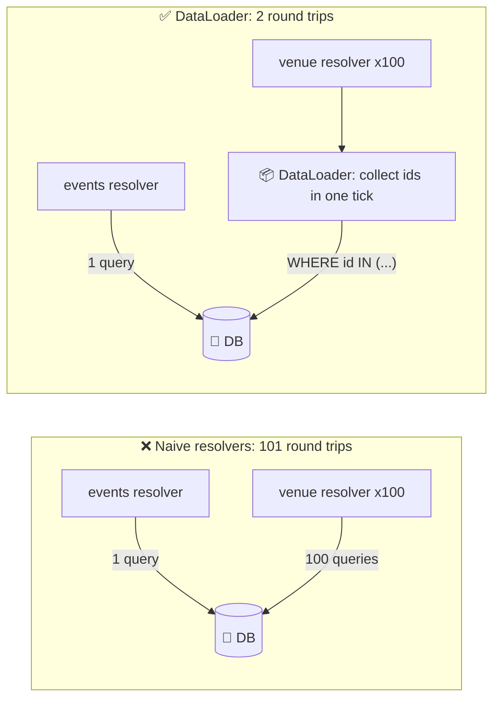
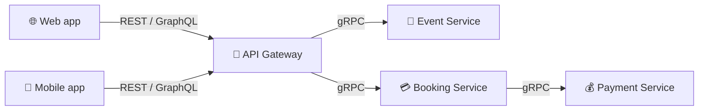
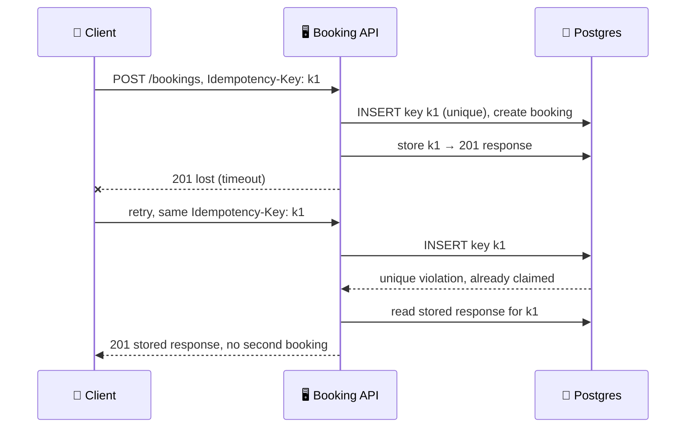

{: .intuition }
> **One-line pitch:** API design is the 5-minute contract-writing step of the interview. Nobody gets hired for a perfect API — but people *do* lose time here. Pick REST, name your resources as plural nouns, show you understand idempotency and pagination, and move on to the parts that actually carry signal.

<details markdown="block">
<summary>Contents</summary>

- TOC
{:toc}
</details>

---

## 1. Where This Fits

This is the **API / System Interface** step of the delivery framework — right after functional requirements, right before high-level design.

{: .pitfall }
> **Time budget: 5 minutes. Hard cap.** Candidates fail this section far more often by *over-investing* than by under-investing. Sketch a reasonable API, say "I'll come back and refine these if the design changes," and go.

**When it matters more than 5 minutes:**

- **Frontend / product-focused roles** — you'll live in APIs daily, so depth is expected.
- **Junior roles** — less expectation on distributed systems, so more interview time lands here.
- **Public-API problems** (Stripe-like, developer platforms) — versioning and idempotency become first-class topics.

**What the interviewer is actually checking:** can you translate core entities into a clean contract, and do you know the handful of production concerns (retries, pagination, auth) that separate someone who has *shipped* an API from someone who has only read about one.

---

## 2. Protocol Choice (First Fork)

| Protocol | Shape | Transport / encoding | Pick it when |
|---|---|---|---|
| **REST** ✅ | **Resource-oriented** | **JSON over HTTP/1.1** | **Default. CRUD-ish, public/client-facing, ~90% of interviews** |
| GraphQL | Query-oriented | JSON over HTTP, single endpoint | Diverse clients with different data needs; over/under-fetching is the stated problem |
| RPC (gRPC) | Action-oriented | Protobuf over HTTP/2 | Internal service-to-service; performance and type safety critical |
| WebSocket / SSE | Persistent connection | Long-lived TCP | Real-time push: chat, live comments, notifications |

{: .say }
> **Interview move.** If you're unsure, just say *"I'll use REST"* and keep moving. Deliberating out loud about protocol choice for two minutes is pure time-burn. Only justify the choice if you're picking something *other* than REST.

### Listening for the signal

Interviewers rarely say "use GraphQL." They plant a phrase:

| What they say | What they want |
|---|---|
| "The mobile app needs different data than web" | GraphQL |
| "Avoid over-fetching / under-fetching" | GraphQL |
| "These are internal microservices" / "latency is critical" | gRPC |
| "Users should see updates without refreshing" | WebSocket / SSE (not a REST question at all) |

{: .aside }
> **Internal APIs are usually below the line.** In the API step, outline **user-facing** endpoints only. Mention "internal services talk over gRPC" once during HLD and leave it there — unless explicitly asked to spec them.

---

## 3. REST — The Default Path

### 3.1 Resource modeling

{: .insight }
> **Your resources are your core entities.** If you did the core-entities step properly, this is free — you already have the list.

Ticketmaster example. Core entities: events, venues, tickets, bookings.

```
GET    /events                   // list events
GET    /events/{id}              // one event
GET    /venues/{id}              // one venue
GET    /events/{id}/tickets      // tickets for an event
POST   /events/{id}/bookings     // create a booking
GET    /bookings/{id}            // one booking
```

**Two rules that are cheap to get right:**

1. **Resources are *things*, not *actions*.** Not `/bookTicket`, not `/processPayment`. If you catch yourself writing a verb in a path, ask *which noun am I actually manipulating?* → `POST /bookings`, `POST /payments`.
2. **Plural nouns.** `/bookings`, not `/booking`. Most interviewers don't care; some do; it costs nothing.

### 3.2 Nesting vs. flat + query params

The deciding question: **is the relationship required or optional?**

| | Nested / path param | Flat / query param |
|---|---|---|
| Example | `/events/{id}/tickets` | `/tickets?event_id=123&section=VIP` |
| Use when | Value is **required** for the request to make sense | Value is **one optional filter among many** |
| Reads as | "the tickets *of* this event" | "tickets, narrowed by whatever you give me" |

{: .pitfall }
> **Don't nest more than one level.** `/venues/{id}/events/{id}/tickets/{id}` is a smell. Once a resource has its own ID, address it directly: `/tickets/{id}`.

### 3.3 HTTP methods and idempotency

| Method | Does | Safe? | Idempotent? | Note |
|---|---|---|---|---|
| **GET** | Read | ✅ | ✅ | Must never mutate. Ever. |
| **POST** | Create | ❌ | ❌ | Server assigns the ID. **Retry = duplicate.** |
| **PUT** | Full replace (or create) | ❌ | ✅ | Same body twice → same final state |
| **PATCH** | Partial update | ❌ | ⚠️ Depends | "set email = X" is idempotent; "append to list" is not |
| **DELETE** | Remove | ❌ | ✅ | Idempotent by *state*, not by status code (204 then 404) |

{: .insight }
> **Idempotent ≠ same response. Idempotent = same final server state.**
>
> This distinction is the one interviewers probe. DELETE returning 404 on the second call is still idempotent — the resource is gone either way. Say it this way and you sound like you've debugged a retry storm.

**Why any of this matters:** networks fail *mid-request*. The client cannot tell "server never got it" from "server did it and the response was lost." Its only move is to retry. Idempotency is what makes that retry harmless.

### 3.4 Where data goes

| Location | Role | Carries |
|---|---|---|
| **Path param** | Structural — *which endpoint* | Required resource identity: `/events/123` |
| **Query param** | Modifier — *how it behaves* | Optional filters, sort, pagination: `?city=NYC&limit=20` |
| **Request body** | Payload — *the actual data* | Complex structures, large or sensitive data |
| **Header** | Cross-cutting metadata | `Authorization`, `Idempotency-Key`, `Content-Type` |

All four in one request:

```
POST /events/123/bookings?notify=true
Authorization: Bearer <jwt>
Idempotency-Key: 8e03978e-740c-4c2e-abd1-52f427d5c177

{
  "tickets": [
    {"section": "VIP",     "quantity": 2},
    {"section": "General", "quantity": 1}
  ],
  "payment_method": "credit_card"
}
```

{: .aside }
> **Never put secrets in a URL.** Query strings land in server access logs, browser history, proxy logs, and `Referer` headers. Tokens, passwords, and PII go in headers or the body — always.

### 3.5 Responses

| Code | Meaning | Use for |
|---|---|---|
| **200** | OK | Successful GET / PUT / PATCH |
| **201** | Created | Successful POST — return the new resource |
| **202** | Accepted | Async work queued (video upload, long job) |
| **400** | Bad Request | Malformed / invalid input |
| **401** | Unauthorized | Not authenticated (*who are you?*) |
| **403** | Forbidden | Authenticated but not permitted (*not yours*) |
| **404** | Not Found | No such resource |
| **409** | Conflict | State clash — seat taken, alias already exists |
| **429** | Too Many Requests | Rate limit breached |
| **500** | Server Error | We broke |

{: .aside }
> Interviewers care that you know **4xx = client's fault, 5xx = our fault**, and that 401 ≠ 403. Nobody is testing whether you memorised 418. Writing `2xx` / `4xx` on the whiteboard is usually fine.

---

## 4. GraphQL — Know It, Don't Default To It

**Origin story worth 10 seconds:** Facebook, 2012. Mobile needed different data than web; every screen change meant a new backend endpoint. REST forced a choice between **endpoint proliferation** and **over-fetching**.

GraphQL collapses many endpoints into **one**, and lets the *client* specify the response shape.

```graphql
query {
  event(id: "123") {
    name
    date
    venue { name address }
    tickets { section price available }
  }
}
```

Schema side:

```graphql
type Event {
  id: ID!
  name: String!
  date: DateTime!
  venue: Venue!
  tickets: [Ticket!]!
}

type Query {
  event(id: ID!): Event
  events(limit: Int, after: String): [Event!]!
}
```

### The costs (say these — it's what shows judgment)

{: .pitfall }
> **N+1 is the signature GraphQL failure.** Query 100 events with their venues → 1 query for events + 100 queries for venues = **101 DB round trips instead of 2.** Fix is a **DataLoader / batching layer** that collects venue IDs within a tick and issues one `WHERE id IN (...)`. It works, but it's complexity REST never made you pay for.



- **Caching is harder.** REST gets HTTP caching free — URL is the cache key. In GraphQL every request is a POST to `/graphql` with a different body, so you need client-side normalized caches (Apollo) or persisted queries.
- **Authorization moves to the field level.** No longer "can you call this endpoint" but "can you see this field" — enforced in resolvers.
- **Unbounded query cost.** A malicious client can request a deeply nested graph and DoS you. Needs query depth limits + complexity scoring.

{: .say }
> **Interview framing:** *"I'd stay on REST. GraphQL solves client-data-shape diversity, which isn't the bottleneck here — and it would cost me HTTP caching plus a DataLoader layer for N+1. If we later had wildly divergent mobile and web clients, that's when I'd revisit."*
>
> Naming the cost you're avoiding beats naming the technology you're avoiding.

---

## 5. RPC / gRPC — Internal Highways

Action-oriented instead of resource-oriented. You call a function; the network is an implementation detail.

```
getEvent(eventId: "123")                        // vs  GET  /events/123
createBooking(eventId: "123", tickets: [...])   // vs  POST /events/123/bookings
getAvailableTickets(eventId: "123", section: "VIP")
```

Contract lives in a `.proto` file, and codegen produces typed clients in every language:

```protobuf
service TicketService {
  rpc GetEvent(GetEventRequest) returns (Event);
  rpc CreateBooking(CreateBookingRequest) returns (Booking);
}

message GetEventRequest { string event_id = 1; }

message Event {
  string id    = 1;
  string name  = 2;
  int64  date  = 3;
  Venue  venue = 4;
}
```

**Why it's faster than JSON/REST — the actual mechanisms:**

- **Protobuf binary encoding** — no field names on the wire, no string parsing. Smaller payloads, cheaper serialization.
- **HTTP/2** — multiplexed streams over one connection (no head-of-line blocking), header compression, no per-request handshake.
- **Bidirectional streaming** — a first-class primitive, not a bolt-on.

**Costs:** not human-readable (can't curl it), browsers need a gRPC-Web proxy, tooling is heavier, and schema changes need care around field numbering.

{: .insight }
> **The standard production shape — and a good line to drop in HLD:** REST or GraphQL at the edge for external clients, gRPC for service-to-service behind the gateway. You get browser compatibility where you need it and wire efficiency where it's hot.



---

## 6. Nine Principles (The Grading Rubric)

You'll never be asked to recite these. They're the standard your design is silently measured against.

| # | Principle | What it means concretely |
|---|---|---|
| 1 | **Resources, not actions** | `POST /payments`, never `/processPayment` |
| 2 | **Consistency** | Not `?status=paid` here and `?state=paid` there. One endpoint should let you guess the rest |
| 3 | **Least surprise** | GET never mutates. 200 never wraps an error. Every deviation taxes every consumer forever |
| 4 | **Stateless** | Each request self-contained → any server handles any request → scaling is an LB problem, not an app problem. This is *why* JWTs are everywhere |
| 5 | **Safe retries** | Idempotency keys on POSTs that create things people care about |
| 6 | **Paginate anything that grows** | Plus a **max page size** — otherwise `?limit=100000` is a free DoS |
| 7 | **Secure by default** | Auth is opt-**out**, not opt-in. AuthN + AuthZ + rate limiting |
| 8 | **Evolve without breaking** | Adding a field is safe. Renaming/removing/re-meaning is not. Old mobile builds live for *years* |
| 9 | **Actionable errors** | Right status class + machine-readable code + human message |

{: .say }
> **You get zero points for listing these and full points for applying them out loud.**
>
> ❌ *"Good APIs should be idempotent."*
>
> ✅ *"I'll put an idempotency key on this booking endpoint so a client retry after a timeout can't double-book the seat."*
>
> Same knowledge. Completely different signal.

---

## 7. Pagination

A list endpoint that works on 50 rows in dev falls over on 5M in prod. **Every collection endpoint gets pagination from day one.**

### Offset-based

```
GET /events?offset=20&limit=10     // rows 21–30
```

- ✅ Dead simple; supports "jump to page 47" and total counts.
- ❌ **Unstable under writes.** Insert a row while the user pages → they see a **duplicate**; delete one → they **skip** a record.
- ❌ **Deep offsets are slow.** `OFFSET 1000000` makes the DB scan and discard a million rows. Cost grows linearly with page number.

### Cursor-based

```
GET /events?limit=10
→ { "events": [...], "next_cursor": "cmd9atj3p000007ky19w1dpy2" }

GET /events?cursor=cmd9atj3p000007ky19w1dpy2&limit=10
```

The cursor is an opaque encoding of the last row's sort position — usually `(timestamp, id)`. The query becomes `WHERE (created_at, id) < (?, ?) ORDER BY ... LIMIT 10`, which is an **index seek, not a scan** — constant cost regardless of depth.

- ✅ Stable under concurrent inserts; O(1) at any depth.
- ❌ No "jump to page 5," no total count, harder to implement.

Why offset duplicates rows (feed sorted newest first, page size 3):

<div class="viz">
<p class="viz-legend"><span class="hl">■ offset page</span> · <span class="done">■ cursor page</span></p>




</div>

| Use | When | Real examples |
|---|---|---|
| Offset | Small/stable datasets, admin tables, users need page numbers | Search results pages |
| **Cursor** ✅ | **Infinite scroll, feeds, high write rate, large datasets** | **Twitter/X timeline, Slack history, Stripe API** |

{: .revisit }
> **Cross-topic link.** Cursor pagination needs a **stable, indexed, unique sort key**. A plain `created_at` isn't unique — two rows at the same millisecond break the cursor. Use a composite `(created_at, id)`. Same B+tree index reasoning from the DB internals notes: the cursor is literally a seek position into the index. See [**Data Modeling**](data-modeling.html) §5.

**Encode cursors opaquely** (base64 the composite key). If clients see a raw ID they'll construct their own, and you can never change the sort key again.

---

## 8. Idempotency Keys

{: .pitfall }
> **The scenario interviewers love:** user taps *Book*. Request times out. Client retries. Did the first one land? If it did, they just bought two sets of tickets and got charged twice.

`POST` isn't idempotent, and "don't retry" isn't an option — networks fail constantly.

**The mechanism:** client generates a UUID per *logical operation* (not per HTTP attempt) and sends it as a header.

```
POST /events/123/bookings
Idempotency-Key: 8e03978e-740c-4c2e-abd1-52f427d5c177

{ "tickets": [{"section": "VIP", "quantity": 2}] }
```

Server side:

1. Look up the key. **Miss** → claim it atomically, process, store `(key → response)`, return.
2. **Hit, completed** → return the *stored* response. Don't re-execute.
3. **Hit, in-flight** → return `409 Conflict` or make the client wait. A concurrent duplicate is still a duplicate.



{: .pitfall }
> **The subtlety most candidates miss: claiming the key must be atomic with doing the work.**
>
> Check-then-insert has the same race as check-then-increment in the rate limiter — two concurrent retries both read "key absent" and both proceed.
>
> Fix it the way you already know how: a **unique constraint** on the key column (second insert fails → you know it's a duplicate), or a **DynamoDB conditional write** with `attribute_not_exists(idempotency_key)`. Exactly the primitive used for Bitly custom-alias reservation.

**Operational details worth surfacing unprompted:**

- **TTL on stored keys** (Stripe uses 24h). Without expiry the table grows forever — the same GC hygiene as `EXPIRE` on rate-limit buckets.
- **Scope keys per user/account** so one tenant can't collide with or probe another's.
- **Store a request-body hash** alongside the key. Same key + *different* body = client bug → reject with 422 rather than silently returning the wrong cached response.

{: .revisit }
> **Pattern: Dealing with Contention.** Third appearance of the same shape — rate limiter token bucket, Bitly alias reservation, and now idempotency keys. **Read-modify-write on shared state must have the atomic boundary drawn around the whole sequence, not just the write.** Recognising this as one pattern across three problems is a senior signal.

---

## 9. Errors, Filtering, Versioning

### Error envelope

Status code = *category*. Body = *what actually happened*.

```json
{
  "error": {
    "code":    "SEAT_UNAVAILABLE",
    "message": "Section VIP has only 1 seat remaining"
  }
}
```

- `code` — stable, machine-readable, safe to branch on. The mobile app opens a seat picker when it sees `SEAT_UNAVAILABLE`.
- `message` — for humans; free to change without breaking anyone.
- **Identical shape on every endpoint** so consumers write error handling once.

In an interview this is a one-liner: *"errors return a consistent envelope with a machine-readable code."* Then move on.

### Filtering and sorting

```
GET /events?city=NYC&status=upcoming&sort=-date&limit=20
```

Convention: leading `-` = descending. The design work isn't inventing params — it's **naming them identically across endpoints**. If events filter by `status`, bookings must not filter by `state`. Show one filtered endpoint and say the conventions hold API-wide.

### Versioning

| Strategy | Looks like | Trade-off |
|---|---|---|
| **URL** ✅ | `/v1/events` | **Explicit, trivially routable, testable in a browser. Purists object that the resource didn't change — ignore them** |
| Header | `API-Version: 2` | Cleaner URLs, better HTTP semantics; invisible and harder to debug |

{: .aside }
> **Notably, most published breakdowns omit versioning entirely** — not because it doesn't matter in practice (it does), but because interviewers almost never probe it. Know the answer, deploy it in one sentence, don't spend the time.

**What's actually breaking vs. safe:**

- ✅ Safe (additive): new optional field, new endpoint, new optional param.
- ❌ Breaking: rename/remove a field, tighten validation, change a type, change a field's *meaning* — the nastiest one, because it passes every schema check and silently corrupts client behaviour.

---

## 10. Security

### AuthN vs AuthZ

- **Authentication** — *who are you?* → 401 when it fails.
- **Authorization** — *are you allowed to do this to this resource?* → 403 when it fails.

John is authenticated as John. Authorization is what stops him cancelling **someone else's** booking.

### API keys vs JWT

| | API Key | JWT |
|---|---|---|
| Identifies | An *application* | A *user session* |
| Shape | Opaque random string (`sk_live_abc123…`) | Signed token carrying claims |
| Validation | DB/cache lookup | **Signature check — no lookup** |
| Expiry | Long-lived, manually rotated | Short-lived (`exp` claim) |
| Revocation | ✅ Immediate — delete the row | ❌ **Hard — that's the whole trade** |
| Use for | Service-to-service, 3rd-party developers | Web and mobile user sessions |

JWT payload:

```json
{ "user_id": "123", "email": "john@example.com", "role": "customer", "exp": 1640995200 }
```

{: .insight }
> **The stateless/revocation trade — worth naming explicitly.** JWTs scale beautifully because *any* service with the verification key validates independently, no shared session store, no DB hit. The exact same property means **you cannot un-issue one.** A stolen token is valid until it expires.
>
> Mitigations: short TTLs (~15 min) + refresh tokens, or a revocation denylist — which reintroduces the lookup you were avoiding. Ban a user and they keep access until expiry. That's the deal you're signing.

{: .revisit }
> **Connects to the rate limiter notes.** "Premium users get 10× the limit" only works at the gateway if tier is a **JWT claim** — the gateway is context-poor and can't afford a DB lookup on the hot path. Same reasoning, seen from the API side.

### RBAC

```
customer      → book tickets, view own bookings
venue_manager → create events, view sales for their venues
admin         → everything
```

Every protected endpoint does two checks:

```
GET /bookings/{id}
1. Authenticated?  → valid JWT signature + not expired
2. Authorized?     → owns this booking OR is admin
```

{: .pitfall }
> **IDOR — the most common real-world API vulnerability.** Checking authentication but not *ownership* means anyone can enumerate `/bookings/1`, `/bookings/2`… and read everyone's data. Authorization must be evaluated against **this specific resource**, not just the role. One sentence about this shows production instinct.

### Rate limiting

- Per-user: 1000/hour authenticated · Per-IP: 100/hour anonymous · Per-endpoint: 10 booking attempts/min
- Enforced at the **API gateway**, returns **429** with `Retry-After`.

In an interview: *"rate limiting at the gateway to prevent abuse"* — one line. Don't design the algorithm unless asked. (Full treatment: **Rate Limiter**.)

---

## 11. Worked Example — Ticketmaster in 5 Minutes

What a clean whiteboard version looks like:

```
// ---- Browse (public, cached, paginated) ----
GET  /v1/events?city=NYC&date_from=2026-01-01&cursor=<c>&limit=20
     → 200 { events: [...], next_cursor: "..." }

GET  /v1/events/{eventId}
     → 200 { id, name, date, venue: {...} }

GET  /v1/events/{eventId}/tickets?section=VIP
     → 200 { tickets: [...] }

// ---- Book (authenticated, idempotent, contended) ----
POST /v1/events/{eventId}/bookings
     Authorization: Bearer <jwt>
     Idempotency-Key: <uuid>
     { tickets: [{section, quantity}], payment_method }
     → 201 { bookingId, status: "CONFIRMED", expiresAt }
     → 409 { error: { code: "SEAT_UNAVAILABLE", ... } }

// ---- Manage (authenticated + ownership check) ----
GET    /v1/bookings/{bookingId}   → 200 | 403 | 404
DELETE /v1/bookings/{bookingId}   → 204
```

{: .say }
> **How to narrate this in ~60 seconds:**
>
> *"REST over HTTPS. Browse endpoints are public, cursor-paginated since the event list grows and users scroll. Booking is a POST — not idempotent by default, so I'm attaching an idempotency key: a client retry after a timeout must not double-book. 409 rather than 400 on seat conflict, because it's a state clash not a malformed request. Booking and management endpoints require a JWT, and management additionally checks ownership so you can't cancel someone else's booking. Rate limiting sits at the gateway. I'd revisit these once the data model lands."*
>
> That's the whole API step — every decision carries its justification in the same breath.

---

## 12. Level Expectations

| Level | What you must demonstrate |
|---|---|
| **Mid** | Pick REST and move. Resources map to core entities, plural nouns, correct verbs. Right status code classes. Doesn't burn 15 minutes here |
| **Senior (E5)** | **Unprompted**: pagination on every collection, idempotency key on create-endpoints that matter, auth on protected routes. Justifies each in the same breath. Knows *why* POST isn't idempotent and what breaks. Can defend REST-vs-GraphQL with concrete costs (N+1, HTTP caching), not vibes |
| **Staff+** | Treats the API as a **long-lived contract**: versioning strategy, additive-vs-breaking change discipline, deprecation path for old mobile builds. Names the JWT revocation trade-off. Raises IDOR, cursor-key stability, idempotency-record TTL and scoping without prompting. Ties API choices to org structure and client rollout velocity |

---

## 13. Personal Drill List

*Targets recurring gaps from previous mock sessions.*

**1. Justify in the same breath.** The narration in §11 is the template — every clause carries its reason. Practice saying it out loud until *"cursor pagination"* automatically becomes *"cursor pagination, because the feed takes concurrent writes and offset would duplicate rows."*

**2. Operational concerns, unprompted.** For APIs the checklist is:

- Idempotency records need a **TTL** and **per-user scoping**
- Pagination needs a **max page size** cap
- Cursors must encode a **stable composite sort key**
- JWTs need a **revocation story**, not just an expiry

**3. Beyond the happy path.** For every endpoint: *what happens on retry? on partial failure? when the client is on a 2-year-old app build?* Retry safety is the API-layer version of the failure-mode reasoning you've been drilling.

**4. Own the contention argument.** Idempotency keys are the third instance of one pattern (rate limiter · Bitly alias · here). Don't wait to be asked — *say* it's the same shape and name the atomic primitive you'd use.

**5. Read path completeness — the API version.** For every `GET`: is it paginated? cacheable (and what's the cache key)? does it need a filter contract? Is there an index backing the sort key?

**6. Watch the clock.** New gap specific to this topic: this section has a **hard 5-minute ceiling**. Over-investing here is the single most common way candidates waste interview time.

---

## 14. Rapid-Fire Self-Test

<details markdown="block">
<summary>1. Why is DELETE idempotent if the second call returns 404?</summary>

Idempotency is about **final server state**, not identical responses. The resource is gone either way.
</details>

<details markdown="block">
<summary>2. Path param or query param for filtering tickets by section?</summary>

Query param — it's an optional filter. Path params are for values **required** to identify the resource.
</details>

<details markdown="block">
<summary>3. Client POSTs a booking, times out, retries. What prevents a double booking?</summary>

An idempotency key. Server stores key → response on first success; the retry returns the stored response instead of re-executing.
</details>

<details markdown="block">
<summary>4. What's the race in a naive idempotency-key implementation?</summary>

Check-then-insert. Two concurrent retries both read "key absent" and both proceed. Fix with a unique constraint or a DynamoDB conditional write — same atomic-boundary fix as the rate limiter's Lua script.
</details>

<details markdown="block">
<summary>5. Two failure modes of offset pagination.</summary>

(a) Concurrent inserts/deletes shift rows → duplicates or skips. (b) Deep `OFFSET` forces the DB to scan and discard N rows — cost grows with page depth.
</details>

<details markdown="block">
<summary>6. Why must a cursor encode a composite key?</summary>

The sort column alone usually isn't unique — two rows sharing a timestamp break the seek. `(created_at, id)` gives a total order.
</details>

<details markdown="block">
<summary>7. 401 vs 403?</summary>

401 = not authenticated (who are you?). 403 = authenticated but not permitted (not yours).
</details>

<details markdown="block">
<summary>8. The one big JWT downside, and why it's inherent.</summary>

Revocation. The stateless validation that makes JWTs scale is exactly what stops you invalidating an issued token. Mitigate with short TTLs + refresh, or a denylist that reintroduces the lookup.
</details>

<details markdown="block">
<summary>9. What is the N+1 problem in GraphQL and how is it fixed?</summary>

Nested field resolution issues one query per parent row (101 queries for 100 events + venues). Fixed by DataLoader batching into a single `WHERE id IN (...)`.
</details>

<details markdown="block">
<summary>10. 409 vs 400 when a seat is already taken?</summary>

409 Conflict. The request was well-formed; the **state** clashed. 400 means malformed input.
</details>

<details markdown="block">
<summary>11. Which API changes are safe to ship without a version bump?</summary>

Purely additive ones: new optional fields, new endpoints, new optional params. Renaming, removing, type changes, tightened validation, and semantic changes are all breaking.
</details>

<details markdown="block">
<summary>12. Endpoint returns 200 with a valid booking for any ID passed. What's wrong?</summary>

IDOR — authentication is checked but not **ownership**. Authorization must be evaluated against the specific resource.
</details>

<details markdown="block">
<summary>13. Why is REST easier to cache than GraphQL?</summary>

REST's URL *is* the cache key, so HTTP/CDN caching works for free. GraphQL POSTs a different body to one endpoint, requiring normalized client caches or persisted queries.
</details>

<details markdown="block">
<summary>14. Two mechanisms that make gRPC faster than JSON-over-HTTP.</summary>

Protobuf binary encoding (no field names on the wire, cheap serialization) and HTTP/2 multiplexing (one connection, no head-of-line blocking, header compression).
</details>

---

*Related patterns to cross-review: Dealing with Contention (idempotency keys) · Scaling Reads (pagination + caching) · Real-time Updates (WebSocket/SSE where REST doesn't fit). Related notes: [**Data Modeling**](data-modeling.html) · [**Caching**](caching.html) · **Rate Limiter** · **Bitly***
