{: .intuition }
> **One-line pitch:** Caching trades freshness for speed. Hot data lives in memory, so most reads skip the database. You only get credit for it after you've *shown* the DB is the bottleneck. You also have to say how the cache stays correct, what happens when a hot key expires, and what happens when the cache dies.

Contents

- TOC
{:toc}

---

## 1. Where This Fits

Caching shows up in **deep dives**, at the moment a non-functional requirement (low latency, high read throughput) collides with the database. It is almost never a first-pass whiteboard component.

{: .pitfall }
> **Don't lead with the cache — earn it.** A Redis box on the first diagram, before any number, reads as pattern-matching. Name the bottleneck, put a number on it, *then* introduce the cache as the fix.

**The four triggers that justify a cache:**

| Trigger | What it sounds like | Back-of-envelope to say out loud |
|---|---|---|
| **Read-heavy workload** | Reads outnumber writes 10:1 to 1000:1 | 10M DAU × 20 reads/day = 200M reads/day ≈ 2.3k QPS average, 5–10× at peak → 10–20k QPS on the same tables |
| **Expensive query** | Multi-table joins, aggregations, fan-in | Personalized feed = posts ⋈ follows ⋈ likes ≈ 200 ms. Compute once, serve from Redis in ≈1 ms for 60 s |
| **DB CPU saturated** | The same queries, over and over | 80% CPU at peak from repeat reads; caching the hot queries removes 70–80% of that load |
| **Latency SLO** | "p99 must be under 10 ms" | DB at 30–50 ms physically cannot meet it; memory can |

{: .aside }
> **Sanity-check the DB number before you lean on it.** A primary-key lookup against a warm Postgres buffer pool is often low single-digit milliseconds. The cache's real wins are on (a) expensive queries, (b) offloading DB CPU and connections, and (c) tail latency under load. A point read that's already fast at low QPS gains little. *"A well-indexed DB is enough here"* is a legitimate senior answer.

---

## 2. Why Caching Works (and What It Costs)

**Memory sits next to the CPU. The database sits behind a network hop, a query planner, locks, and (eventually) a disk.** A cache skips all of that.

| Read from | Rough latency | Why |
|---|---|---|
| In-process memory (hash map) | Nanoseconds to low µs | No network, no serialization |
| Redis / Memcached, same data centre | ≈0.5–1 ms | One network round trip; the lookup itself is negligible |
| Postgres indexed read | ≈1–50 ms | Depends on buffer-pool warmth, row size, concurrent load |
| Expensive join / aggregation | 100s of ms | Work scales with rows touched |
| Cross-continent origin (Virginia → India) | 250–300 ms | Speed of light + multiple round trips |
| CDN edge near the user | 20–40 ms | Content is already in the user's region |

{: .aside }
> **The database already caches.** Postgres keeps hot pages in `shared_buffers` plus the OS page cache. So "the DB reads from disk" is a simplification. What an application cache really saves you is the network hop, query parsing/planning, lock contention, connection-pool pressure, and load on a box that is also serving writes.

{: .insight }
> **Every cache is a second copy of the truth.**
>
> You buy: lower latency, lower DB load, cheaper read scaling.
>
> You pay: (1) **staleness**: the copy can disagree with the source; (2) **new failure modes**: stampedes, hot keys, cold starts; (3) **a load-bearing dependency**: once the DB is sized assuming a 95% hit rate, the cache is no longer optional.

---

## 3. Where to Cache — The Layers

Caching exists at every layer of the stack. Interviewers care most about the external cache; the others are add-ons you introduce only when the problem calls for them.

### 3.1 External cache (Redis / Memcached) — the default

A standalone cache service the application talks to over the network.

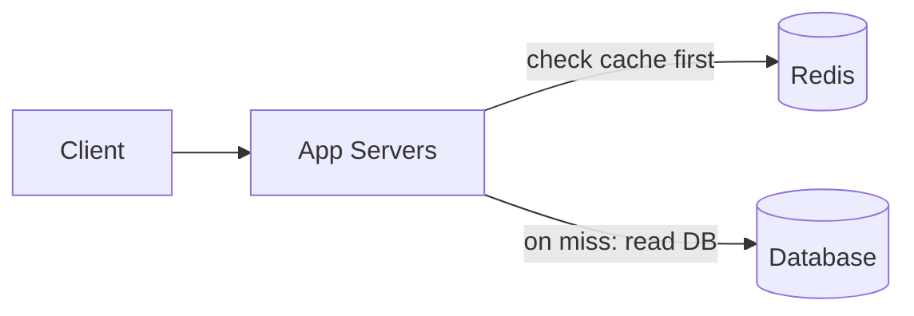

- **Shared across all app servers.** There's one warm copy, and every instance sees an invalidation (unlike in-process).
- **Scales horizontally.** Redis Cluster shards keys across nodes by hash slot (16,384 slots).
- **Bounded memory.** An eviction policy (LRU/LFU) plus per-key TTL keeps the footprint under control.

| | Redis | Memcached |
|---|---|---|
| Data model | Strings, hashes, lists, sets, sorted sets, streams | Opaque string key → value |
| Persistence | Optional (RDB snapshots, AOF log) | None |
| HA | Replicas, Sentinel, Cluster | None built in; client-side sharding |
| Atomic ops | INCR, Lua scripts, MULTI, SET NX | CAS, incr/decr |
| Threading | Single-threaded command execution (optional I/O threads) | Multithreaded |
| **Pick when** | **Default.** You need structures, atomics, or durability options | Pure, simple, very high-volume KV caching |

{: .say }
> **Interview default:** *"Redis, cache-aside."* Start there. Layer on CDN, client-side, or in-process caching only when the problem specifically calls for it.

{: .insight }
> **Redis-as-cache vs Redis-as-store: same software, different contract.**
>
> As a **cache**: every key is reconstructible from the DB, eviction is on (`allkeys-lru` / `allkeys-lfu`), losing Redis = a burst of misses.
>
> As a **store** (rate-limit buckets, sessions, leaderboards): Redis *is* the source of truth, eviction must be off (`noeviction`), persistence and replication matter, losing Redis = data loss.
>
> Say which one you mean. The token buckets in **Rate Limiter** are Redis-as-store, not a cache.

### 3.2 CDN (Content Delivery Network)

A geographically distributed network of edge servers holding copies of your content close to users.

**How it works:**

1. User requests an image → routed to the nearest edge (DNS / anycast).
2. **Hit** → edge serves it immediately.
3. **Miss** → edge fetches from your origin once, stores it, serves it.
4. Every later user in that region gets the edge copy.

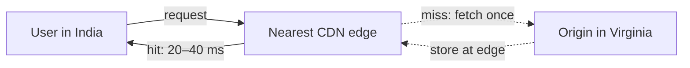

Without a CDN, a user in India hitting a Virginia origin pays **250–300 ms per request**. With an edge nearby: **20–40 ms**. For a page with 30 images, that difference is the whole user experience.

**What modern CDNs cache:** static media (the primary, most impactful use), public API responses, HTML pages. They also run edge logic (personalization, auth checks, WAF rules) before traffic reaches you.

| Concern | Options |
|---|---|
| Pull vs push | **Pull** (default): edge fetches from origin on miss, i.e. a read-through cache. **Push**: you upload ahead of demand, e.g. large launches, pre-segmented video |
| Freshness | `Cache-Control: max-age` sets the edge TTL; `stale-while-revalidate` serves the old copy while refreshing |
| **Invalidation** ✅ | **Versioned / content-hashed URLs** (`app.3f9a2c.js`, `/img/v7/banner.jpg`). New version = new key, so nothing needs purging. Purge APIs exist but are slower and global, so they're a fallback |
| Private content | Signed URLs with short expiry; the edge still caches the bytes |

{: .say }
> **When to introduce it:** the safest trigger is *"we serve static media at scale to a global audience."* Lead with that reason, then extend to API responses or edge logic only if the problem calls for it.

{: .revisit }
> **Cross-topic links.** **Dropbox** downloads are the CDN + signed-URL case. **API Design**: REST GETs are CDN-cacheable because the URL *is* the cache key. GraphQL gives up exactly this.

### 3.3 Client-side caching

Data stored at the requester to avoid the network entirely.

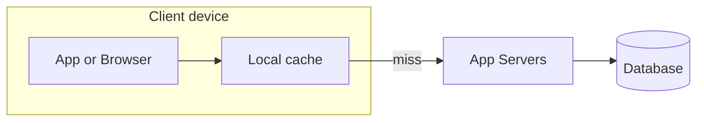

- **User-facing:** browser HTTP cache, `localStorage` / IndexedDB, mobile on-device storage. Strava keeps your run on the phone while offline and syncs later. A browser reusing a downloaded image from disk is also client caching.
- **Conditional requests:** the server sends an `ETag`; the client later asks `If-None-Match` and gets `304 Not Modified` with no body. It's still a round trip, but with no payload.
- **Inside client libraries:** Redis Cluster clients cache the slot → node map so they route each command straight to the right node, refreshing only when they receive a `MOVED` redirect.

{: .pitfall }
> **You have limited control from the backend.** Data goes stale, and invalidation is hard because you can't reach into a phone and delete a key. The client can also tamper with anything stored there, so never rely on a client cache for anything security-relevant.

### 3.4 In-process caching

App servers have plenty of RAM. Cache small, hot data **inside the application process**. There's no network call at all, so it's faster even than Redis.

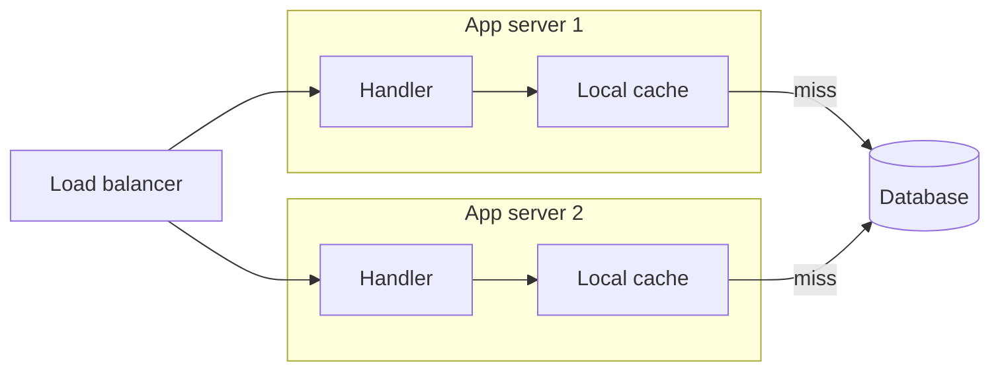

**Good candidates:** configuration values, feature flags, small reference datasets (country codes, currency tables), extremely hot keys, rate-limiting counters, precomputed values.

**Limitations:**

- **Not shared.** N instances = N copies, N cold starts, N times the memory.
- **Invalidation doesn't propagate.** When one instance updates or evicts a value, the others don't know. Mitigate with short TTLs or a broadcast (Redis pub/sub) telling every instance to evict.
- **Heap pressure.** On the JVM, a large in-heap cache means longer GC pauses. Keep it small.

{: .aside }
> **Java / Spring Boot shape.** Caffeine is the standard in-process cache (W-TinyLFU eviction, per-key load coalescing out of the box). Spring's `@Cacheable` can sit on top of Caffeine locally or Redis remotely: same annotation, different layer.

{: .pitfall }
> **In-process rate-limit counters are approximate.** With N instances each counting locally, the effective limit is ≈ N × the configured limit (unless traffic is sticky). That's fine as a cheap first gate, but it's not the authoritative limiter. This is the same reasoning as the distributed-counter discussion in **Rate Limiter**.

{: .say }
> **Interview framing:** mention in-process caching only as an **optimization layer on top of** an external cache, typically for hot keys or config. It's great for speed, but it doesn't replace Redis.

### 3.5 Layer comparison

| Layer | Lives in | Latency | Shared across servers? | Who controls invalidation | Use for |
|---|---|---|---|---|---|
| Client-side | Browser / device | Zero network | No, per user | Mostly the client; server only via headers | Static assets, offline data, user's own data |
| CDN | Edge PoPs | 20–40 ms | Yes, per region | Server via Cache-Control, versioned URLs, purge | Static media, public pages and API responses |
| In-process | App server heap | ns–µs | No, per instance | Each instance separately | Config, flags, reference data, hot keys |
| **External (Redis)** ✅ | **Dedicated cluster** | **≈1 ms** | **Yes** | **The app, explicitly** | **Entities, query results, computed feeds, sessions** |
| DB buffer pool | DB memory | Part of the query | Yes | The DB itself | Automatic; you don't design this |

---

## 4. Cache Architectures (Read / Write Patterns)

Two questions decide the pattern. **Who talks to the database**: the app or the cache? **When does a write reach the database**: before the ack, or later?

### 4.1 Cache-aside (lazy loading) — the default

**Read path:**

1. App checks the cache.
2. Hit → return it.
3. Miss → app reads the DB, writes the result into the cache, returns it.

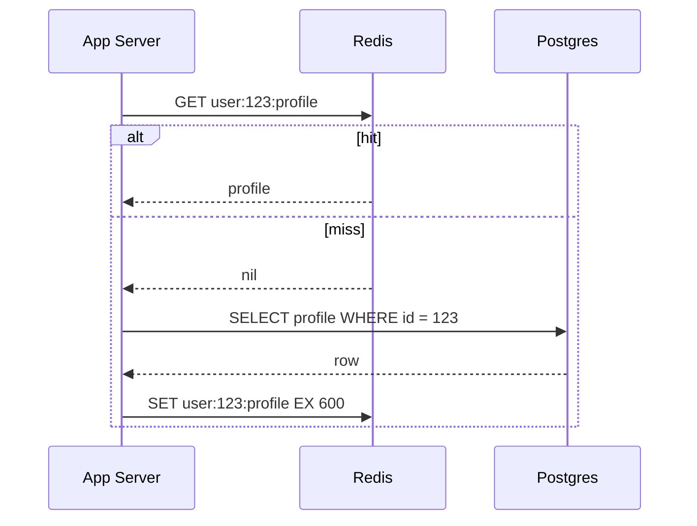

**Write path:** app writes the DB, then **deletes** the cache key. The next read repopulates it.

- ✅ **Lean:** only data that's actually read gets cached.
- ✅ **Resilient:** if the cache is down, the app can still go to the DB.
- ✅ **Works on plain Redis:** no special cache infrastructure.
- ❌ **Miss penalty:** a miss costs three hops (cache, DB, cache write).
- ❌ **The app owns the logic:** every service re-implements it unless it's wrapped in a library/annotation.

{: .insight }
> **Two write-path rules interviewers probe:**
>
> **1. Write the DB first, then delete the cache.** Deleting first opens a window: a concurrent reader misses, reads the *old* row, and re-caches it before your write commits.
>
> **2. Delete, don't update.** Two writers can commit to the DB in order A → B but SET the cache in order B → A, leaving A cached indefinitely. DEL is order-insensitive and idempotent, so the next reader loads whatever the DB says *now*.

{: .aside }
> **Spring Boot:** `@Cacheable` / `@CacheEvict` is cache-aside behind annotations, with the method body as the loader. `@Cacheable(sync = true)` coalesces concurrent loads of the same key on a single instance.

{: .revisit }
> **Textbook case:** the redirect path in **Bitly**. Short code → long URL is effectively immutable and read far more than written, so invalidation is a non-problem and popular links hit nearly 100% of the time.

{: .insight }
> **If you only remember one pattern for interviews, make it cache-aside.**

### 4.2 Write-through

The app writes **only to the cache**; the cache **synchronously** writes the DB before acknowledging. The write isn't complete until both are updated.

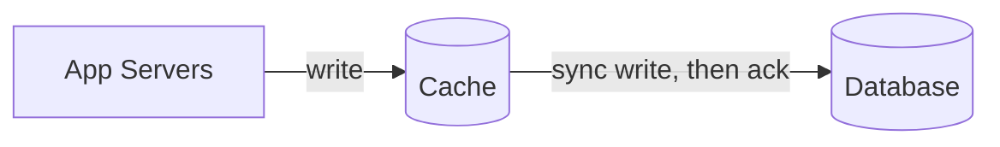

**Needs a cache that supports it:** a caching library with a data-store plugin (Hazelcast MapStore, Ehcache loader-writer) or a managed layer like DynamoDB DAX. **Redis does not do this natively**; with Redis it's just application code.

- ✅ Reads always see the latest write.
- ❌ **Slower writes:** latency = cache write + DB write.
- ❌ **Cache pollution:** data that's written but never read still occupies memory. Pair with a TTL.
- ❌ **Dual-write problem:** if one write succeeds and the other fails, cache and DB diverge. You need retries and error handling; perfect consistency would need a distributed transaction.

**Use when** reads must always be fresh and slightly slower writes are acceptable. It comes up less in interviews because it needs specialized infra and still has consistency edge cases.

### 4.3 Write-behind (write-back)

The app writes **only to the cache** and gets an immediate ack; the cache **batches and flushes to the DB asynchronously**.

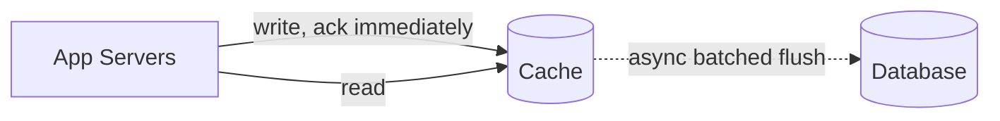

- ✅ **Fastest writes**, and batching coalesces work: 100 increments → one DB write.
- ✅ Absorbs write spikes the DB couldn't take directly.
- ❌ **Data loss** if the cache dies before flushing.
- ❌ The DB lags, so anything reading the DB directly sees old data.
- ❌ Ordering and retry-on-flush-failure complexity.

**Use when** write throughput matters and eventual consistency (plus occasional loss) is acceptable: analytics, metrics, view/like counters.

{: .aside }
> **Concrete shape:** `INCR video:42:views` in Redis on every view; a worker flushes deltas every few seconds with `UPDATE videos SET views = views + delta`. Redis AOF with `fsync everysec` bounds the loss window to about a second.
>
> This is the answer for **write-heavy** hot paths, where a read cache does nothing.

### 4.4 Read-through

The cache is a **smart proxy**. The app never talks to the DB directly; on a miss, **the cache itself** loads from the DB, stores, and returns.

Read-through is the read-side twin of write-through: in both, the cache is the intermediary that handles DB operations. Systems often combine them.

- ✅ Centralizes loading logic, which makes it a natural place for per-key single-flight.
- ❌ Needs a specialized library or service; less control; less common in practice.

**Real examples:** a pull CDN is a read-through cache (miss → edge fetches from origin). Others are Caffeine's `LoadingCache` in-process and DynamoDB DAX.

{: .insight }
> **Cache-aside vs read-through look identical on a whiteboard.** The difference is **who executes the miss**: the app (cache-aside) or the cache (read-through). Say who owns the loader.

{: .say }
> There are very few reasons to propose read-through for application-level Redis. Bring it up when discussing **CDNs** or similar infrastructure.

### 4.5 Pattern comparison

| Pattern | Read path | Write path | Freshness | Main risk | Use when |
|---|---|---|---|---|---|
| **Cache-aside** ✅ | **App checks cache; on miss app reads DB and fills cache** | **App writes DB, then DELs key** | **Stale until invalidation / TTL** | **Miss latency; stale-set race** | **Default; read-heavy** |
| Read-through | App asks cache; cache loads DB on miss | Paired with write-through, or app writes DB | Same as cache-aside | Needs library / managed support | CDNs, DAX, loading caches |
| Write-through | Reads hit cache | App → cache → DB, synchronous | Fresh on reads | Slow writes, pollution, dual-write divergence | Reads must be fresh; writes can be slower |
| Write-behind | Reads hit cache | App → cache; async batch to DB | Cache fresh, DB lags | Data loss if cache fails | High write volume, loss-tolerant |

---

## 5. Eviction Policies

Cache memory is finite. When it's full, the eviction policy decides what goes.

| Policy | Evicts | Mechanism | Good for | Weakness |
|---|---|---|---|---|
| **LRU** ✅ | **Least recently accessed** | **Hash map + doubly linked list (or ring buffer) → O(1) evict** | **Most workloads: recent use predicts reuse** | **A one-off scan (batch job touching every key once) flushes the hot set** |
| LFU | Least frequently accessed | Per-key counter, usually approximate with decay | Stable popularity: trending videos, top playlists | Slow to adapt; without decay, yesterday's hits linger |
| FIFO | Oldest inserted | Simple queue | Trivial caching layers | Ignores usage, so it evicts keys that are still hot. Rarely used |
| TTL *(not eviction)* | Expired keys | Per-key expiry timestamp | Bounding staleness: API responses, sessions, tokens | Many keys with the same TTL expire together → stampedes |

LRU with capacity 3, ordered least-recent (left) → most-recent (right):

■ just accessed






{: .insight }
> **TTL answers "how stale can this get?" Eviction answers "what do I drop when memory is full?"** These are different questions, and you almost always want both: LRU (or LFU) for memory pressure, TTL for freshness.

{: .aside }
> **Redis specifics worth one sentence:**
>
> - The default `maxmemory-policy` is **`noeviction`**: when memory fills, writes start returning errors. For a cache, set `allkeys-lru` or `allkeys-lfu`. (`volatile-*` variants only evict keys that carry a TTL.)
> - Redis LRU/LFU are **approximated by sampling** a handful of keys, not exact. That's memory-cheap and good enough.
> - **Add jitter to TTLs.** Warm a million keys with `EX 600` and they all expire in the same second. Use 600 ± 60 s.

{: .say }
> **The whole eviction answer for most problems:** *"LRU eviction, a 10-minute TTL on profiles with some jitter, and an explicit delete on write."* LRU is the safe default; TTL is essential whenever data must eventually refresh.

---

## 6. Failure Modes

If you bring up caching, you'll be tested on these. Interviewers use them to check that you understand the **costs**, not just the benefits.

### 6.1 Cache stampede (thundering herd)

A popular key expires. For a brief window (even under a second), **every** request misses and goes to the DB. One query becomes thousands.

**Example:** the homepage feed is cached with a 60 s TTL. At 12:01:00 it expires, and every request in that instant runs the same expensive query. The DB slows, requests time out, clients retry, and load climbs further: a cascading failure.

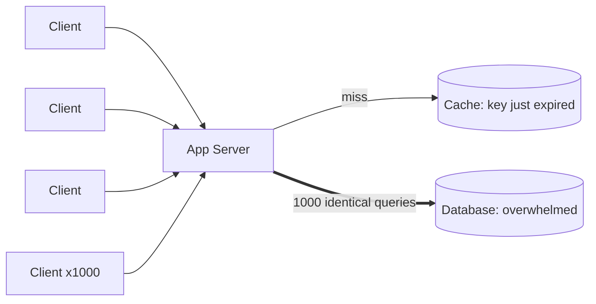

| Fix | How it works | Notes |
|---|---|---|
| **Request coalescing (single-flight)** ✅ | **Only one request rebuilds the key; the rest wait for its result** | **Most effective.** In-process: per-key future/lock. Distributed: `SET lock:key token NX PX 5000`. The winner rebuilds; losers wait briefly and re-read (or serve stale) |
| Cache warming / proactive refresh | Background job refreshes hot keys before they expire | **Only helps with TTL-based expiry.** If you invalidate on write, the key vanishes instantly, so there's nothing to refresh ahead of |
| Probabilistic early expiration | As expiry approaches, each request has a rising chance of refreshing early | One request refreshes before the key goes cold, with no coordination needed |
| Stale-while-revalidate | Keep serving the old value while one request refreshes in the background | Needs a soft (logical) TTL plus a longer hard TTL |
| TTL jitter | Randomize expiries | Prevents many keys expiring in the same second |

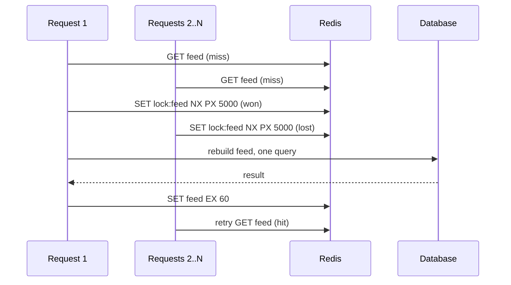

{: .revisit }
> **Pattern: Dealing with Contention, fourth appearance.** Rate limiter (Lua check-and-increment) · Bitly custom alias (conditional write) · idempotency keys (unique constraint) · and now the stampede lock (`SET NX`). It's the same shape every time: **an atomic claim of a shared resource.**
>
> The lock needs a TTL (`PX`) so a crashed rebuilder can't hold it forever. That's the same expiry hygiene as idempotency-key TTLs.

{: .insight }
> **Staff-level reference: Facebook's memcache leases** (*Scaling Memcache at Facebook*, NSDI 2013). On a miss, the cache hands out a lease token. Only the lease holder may fill the key, and leases are rate-limited per key, so concurrent missers wait instead of stampeding. A delete invalidates outstanding leases, so a slow reader's late write is rejected. **One mechanism fixes both the stampede and the stale-set race (§6.2).**

### 6.2 Cache consistency

Reads go to the cache and writes go to the DB, so there's always a window where the cache holds the old value.

**Example:** a user updates their profile picture. The DB has the new one, but the cache still has the old one. Other users see the old picture until the entry is invalidated or expires.

**There is no perfect fix. You pick a strategy based on how fresh each piece of data must be.**

| Strategy | Staleness | Cost | Fits |
|---|---|---|---|
| **Invalidate on write** ✅ | **≈ms: next read reloads** | **Every write path must remember to DEL** | **User-facing entities: profiles, settings** |
| Short TTL only | Up to the TTL | No write-path work; more misses | Data where seconds or minutes of staleness is invisible |
| Accept eventual consistency | Bounded by TTL / refresh interval | Cheapest | Feeds, counts, metrics, trending |
| CDC-driven invalidation | ≈ replication lag | Infra: tail the DB log (Debezium on the WAL) → invalidator | Many services write the same data; you can't trust every path to DEL |
| Don't cache it | Zero | Full DB load | Seat inventory, balances, anything you transact on |

{: .pitfall }
> **The stale-set race: cache-aside's subtle bug.** Correct write ordering still isn't enough on its own:

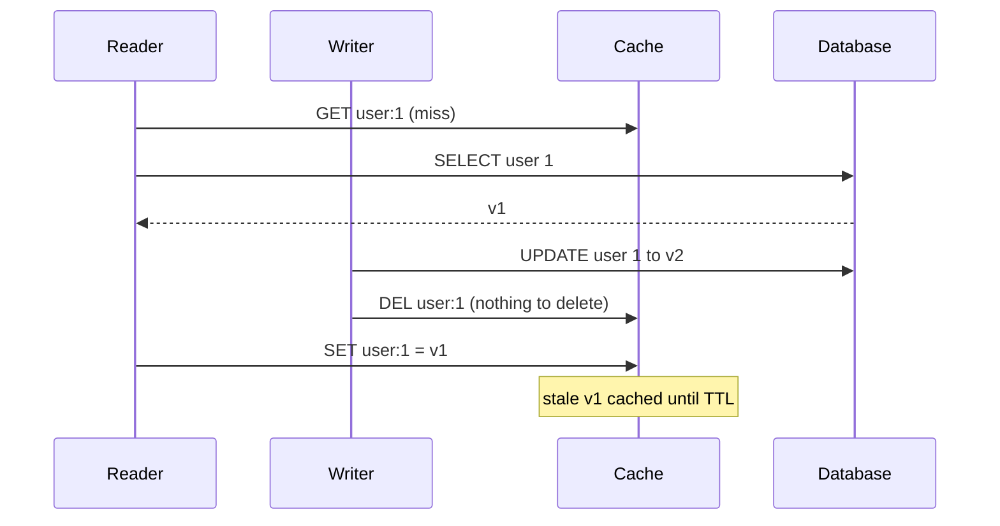

The window is narrow, but at scale it happens. **Fixes, cheapest first:**

1. **TTL as a safety net, always.** Any race or missed invalidation heals itself within one TTL.
2. **Delayed double-delete:** DEL again a few hundred ms after the write.
3. **Versioned / conditional set:** store a version with the value; a Lua script only SETs if the incoming version is newer.
4. **Leases** (Facebook, §6.1) or **CDC invalidation:** ordering comes from the DB log, not from racing app threads.

### 6.3 Hot keys

One key receives a disproportionate share of traffic. Even at a 99% hit rate, every request for that key lands on **the same Redis shard**, and that node saturates.

**Example:** on Twitter, everyone opens Taylor Swift's profile. `user:taylorswift` gets millions of requests per second, while a single Redis node handles on the order of 100k ops/sec. Everything is working "correctly" and one shard is still on fire.

{: .insight }
> **Hot key ≠ stampede.**
>
> **Stampede:** the key is *missing* → the **database** gets flooded.
>
> **Hot key:** the key is *present* → the **cache node** gets flooded.
>
> They're different problems with different fixes. Mixing them up in narration costs credibility.

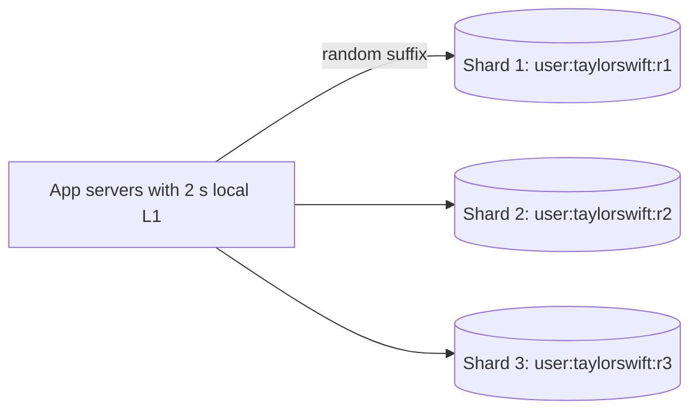

| Fix | How | Trade-off |
|---|---|---|
| **Replicate the hot key** | Store copies as `user:taylorswift:r1` … `:r10` so they hash to different shards; reads pick a random suffix | Load spreads N ways; writes and invalidations must fan out to all N copies |
| **Local in-process fallback (L1)** | Cache the hottest values in each app server for 1–5 s | Absorbs most traffic before it reaches Redis; a few seconds of per-instance staleness |
| **Read replicas** | Redis replicas serve reads for that slot | Replication lag → slightly staler reads |
| **Rate limiting** | Throttle abusive patterns on that key | Protects the shard; some requests get degraded |

**Detection:** `redis-cli --hotkeys` (requires an LFU eviction policy), client-side key sampling, CPU skew across shards.

{: .revisit }
> **Pattern: Scaling Reads.** Hot keys aren't a cache-only problem. Sharding assumes keys are roughly uniform in load. Viral content breaks that assumption everywhere: caches, DB partitions, message-queue partitions.

### 6.4 The cache goes down

If Redis is unavailable, every request falls through to the database.

{: .insight }
> **DB load multiplier on cache loss = 1 ÷ miss rate.**
>
> At a 95% hit rate, the DB normally sees 5% of reads, so losing the cache = a **20× load spike**. At 99%, it's **100×**.
>
> The better your hit rate, the more load-bearing (and the more dangerous) your cache becomes.

**Mitigations:**

- **Tight client timeouts + circuit breaker.** A slow cache is worse than no cache. Fail fast, trip the breaker.
- **Protect the DB on the fallback path.** Rate-limit or shed load so a cache outage doesn't become a DB outage.
- **In-process L1** for the hottest keys as a last-resort layer.
- **HA for the cache itself:** replicas with automatic failover (Sentinel, Redis Cluster, or managed: ElastiCache, Azure Cache for Redis).
- **Cold start:** after a restart or failover, warm the hottest keys or ramp traffic gradually before taking full load.

---

## 7. Interview Playbook — Five Steps

### Step 1 · Identify the bottleneck

Point at the specific problem (DB load, query latency, or expensive computation) with a number.

*"Profile reads hit Postgres around 500 times a second at peak, ≈30 ms each, and it's the same rows over and over. That's the hot path."*

### Step 2 · Decide what to cache

Cache data that is **read often, changes rarely, and is expensive to fetch or compute**, and that can tolerate brief staleness.

*"Profiles: read on every page load, edited only from settings. The trending feed: an expensive aggregation that only needs to refresh once a minute."*

**Key design:**

- `entity:id:facet`, e.g. `user:123:profile`, `trending:posts:global`.
- A **version prefix** (`v2:user:123:profile`) lets you invalidate everything after a schema change just by bumping the prefix.
- **Watch key cardinality.** Caching every arbitrary search query creates unbounded keys with a terrible hit rate.
- **Size it:** 10M users × 1 KB ≈ 10 GB; the hot 20% ≈ 2 GB → fits on one modest node.

**Equally important: what NOT to cache.**

| Don't cache | Why |
|---|---|
| Data you transact on: seat availability at checkout, balances, inventory | A stale read means overselling or double-spending. Read and lock inside the DB transaction |
| Write-heavy, rarely-read data | Constant invalidation churn, almost no hits |
| Long-tail, low-reuse reads | Hit rate too low to justify the memory |
| Already-fast indexed lookups at low QPS | Added complexity, no measurable win |
| Per-request unique responses | Zero reuse |

### Step 3 · Choose the architecture

Match the pattern to the consistency requirement. Default to **cache-aside**. Use write-through when reads must be fresh and write-behind for high-volume, loss-tolerant writes. Add a **CDN** for static media and an **in-process** layer for extremely hot keys.

*"Cache-aside: check Redis; on a miss, query Postgres, populate Redis, return."*

### Step 4 · Set eviction and TTL

LRU is the safe default, TTL bounds staleness, and explicit invalidation handles user-visible edits.

*"LRU in Redis, 10-minute TTL on profiles with jitter, and a delete on every profile update so the owner sees their change immediately."*

### Step 5 · Address the downsides

Pick the one or two that matter for **this** system:

- **Invalidation:** *"On profile update we delete the key; the next read reloads from Postgres."*
- **Cache failure:** *"If Redis is down we fall back to Postgres behind a circuit breaker, with a small in-process cache for the hottest keys."*
- **Stampede:** *"For the trending feed, single-flight on rebuild so one request recomputes while the rest wait."*

{: .say }
> **Don't recite every failure mode.** Pick the one this system will actually hit and go deep. At staff level, spend the time on the **non-obvious** scenarios (the stale-set race, the 1 ÷ miss-rate blast radius, a hot key pinning one shard) rather than things the interviewer already assumes you know.

---

## 8. Decision Cheat Sheet

| Situation | Reach for |
|---|---|
| Static media served to a global audience | CDN with content-hashed URLs |
| Read-heavy entity lookups | Redis cache-aside + TTL + delete on write |
| Expensive computed result (feed, leaderboard, aggregates) | Precompute, cache with TTL, refresh asynchronously |
| Tiny, hot, rarely-changing data (config, flags) | In-process cache with short TTL or pub/sub eviction |
| One viral key hammering a shard | Replicate the key across shards + in-process L1 |
| Popular key expiring under heavy load | Single-flight lock, early refresh, or stale-while-revalidate |
| Write-heavy counters | Write-behind: aggregate in Redis, flush in batches |
| Reads must reflect the latest write | Write-through, or don't cache |
| Correctness-critical data (inventory, money) | Don't cache the authoritative read |

---

## 9. Worked Example — Ticketmaster Event Page

**Setup:** event pages are read vastly more than they're written. At on-sale time for a major artist, millions of users refresh **the same event**.

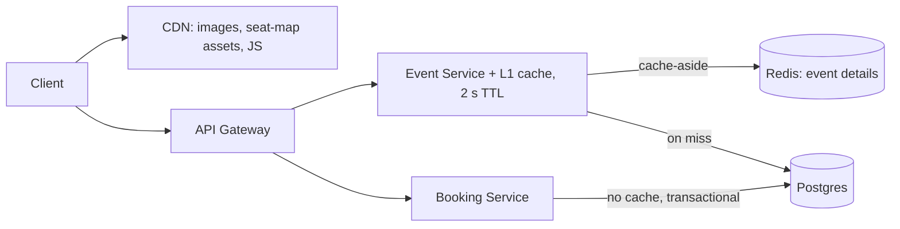

| Data | Decision | Why |
|---|---|---|
| Venue images, seat-map SVGs, JS bundles | CDN, content-hashed URLs | Static, global, immutable per version |
| Event details (name, date, venue, lineup) | Redis cache-aside, 10 min TTL + jitter, DEL on edit | Read on every page view, edited rarely |
| Seat counts shown while browsing | Short TTL (≈5 s), display only | Users tolerate approximate counts while browsing |
| **Seat availability at booking** 🔴 | **No cache: read and lock in a DB transaction** | **A stale read here is an oversell** |
| The one hot on-sale event | In-process L1 (2 s) + single-flight on rebuild | Hot key *and* stampede risk on a single key |

{: .say }
> **How to narrate this in ≈60–90 seconds:**
>
> *"Event pages are read-heavy: every view reads the event, and edits happen a few times total. So event details go in Redis, cache-aside, with a 10-minute TTL with jitter, deleted on edit so organizers see their changes immediately. Images and seat-map assets go on a CDN with content-hashed URLs, so deploys never need a purge. Seat availability is the one thing I won't cache authoritatively. The browse view can show counts that are a few seconds stale, but the booking path reads and locks seats inside a Postgres transaction, because a stale read there is an oversell. At on-sale, one event becomes a hot key, so the event service keeps a 2-second in-process copy and single-flights the rebuild. That protects both the Redis shard and Postgres. If Redis goes down, we fall back to Postgres behind a circuit breaker. At a 95% hit rate that's a 20× load jump, which is why Redis runs with replicas and automatic failover."*
>
> Every decision carries its reason in the same breath.

---

## 10. Level Expectations

| Level | What you must demonstrate |
|---|---|
| **Mid** | Adds Redis cache-aside on the obvious read path. Mentions TTL and LRU. Invalidates on write. Knows a CDN is for static media |
| **Senior (E5)** | **Earns the cache with a number first.** Says what is and isn't cached, and why (e.g. not seat inventory). Names the key schema and a TTL per data type. Gets write ordering right: DB commit, then DEL. Handles the one failure mode the system will actually hit with a concrete mechanism. Knows what happens when Redis dies |
| **Staff+** | Designs caching as **layers with an explicit staleness budget per data type**. Quantifies cache-loss blast radius (1 ÷ miss rate) and sizes HA and DB headroom accordingly. Raises the stale-set race and the mechanisms that fix it (leases, versioned sets, CDC). Separates hot key from stampede and Redis-as-cache from Redis-as-store. Argues cost (memory vs extra read replicas) and knows when a well-indexed DB is enough |

---

## 11. Personal Drill List

*Targets recurring gaps from previous mock sessions.*

**1. Earn the cache with a number.** Template: *"X QPS × Y ms on table Z, same rows repeatedly, so…"* No number, no cache.

**2. Justify in the same breath.**

❌ *"I'll add Redis."*

✅ *"Cache-aside in Redis with a 10-minute TTL, because profiles are read on every page view but edited maybe once a month. And I'll delete on write so the owner sees their own edit immediately."*

**3. Operational concerns, unprompted.** For caching the checklist is:

- TTL **jitter**
- `maxmemory-policy` set, not left at the `noeviction` default
- Cache-client **timeouts + circuit breaker**
- **Load multiplier** if the cache dies (1 ÷ miss rate)
- **Lock TTL** on any single-flight lock
- **Key cardinality** and a rough memory size

**4. Read-heavy vs write-heavy check.** Same gap as the rate limiter: caching is a **read-scaling** tool. Before proposing it, ask *"is this path actually read-heavy?"* Write-heavy hot paths (counters, rate-limit buckets) need write-behind aggregation or Redis-as-store, not a read cache.

**5. Own the contention argument.** The stampede lock is the fourth instance of *atomic claim of a shared resource*. Say so, and name the primitive: `SET key token NX PX`.

**6. Say what you won't cache.** Explicitly excluding seat inventory or balances costs one sentence and signals correctness instinct.

**7. Go deep on one failure mode** instead of listing four shallowly.

---

## 12. Rapid-Fire Self-Test

1. Default caching pattern for application-level caching, and why?

Cache-aside. The app checks Redis; on a miss it reads the DB and fills the cache. It's lean (only caches what's read), survives cache failure, and works on plain Redis.

2. Cache-aside write path: what order, and why delete instead of update?

Commit to the DB first, then DEL the key. Delete-first lets a concurrent reader re-cache the old row. SET-on-write lets two writers' cache updates land out of order and leave the older value cached. DEL is order-insensitive.

3. Write-through vs write-behind?

In both, the app writes to the cache. Write-through: the cache writes the DB synchronously before the ack, giving fresh reads but slower writes and dual-write risk. Write-behind: the cache flushes to the DB asynchronously in batches, giving the fastest writes, but data is lost if the cache dies before flushing.

4. Does Redis support write-through natively?

No. You need a caching library with a DB plugin (Hazelcast MapStore, Ehcache loader-writer), a managed layer like DynamoDB DAX, or application code.

5. A pull CDN is which caching pattern?

Read-through. On a miss, the edge itself fetches from the origin, stores, and serves.

6. When does cache warming fail to prevent a stampede?

When keys are invalidated on write rather than expiring via TTL. The key disappears instantly, so there's nothing to refresh ahead of time.

7. Most effective stampede fix, and how do you do it across many servers?

Request coalescing / single-flight. With `SET lock:key token NX PX 5000`, the winner rebuilds; others wait and re-read, or serve stale. The lock TTL prevents a crashed rebuilder from wedging it.

8. Hot key vs stampede?

Stampede: the key is missing → the database gets flooded. Hot key: the key is present → a single cache shard gets flooded. They need different fixes.

9. Three hot-key mitigations.

Replicate the key under suffixes across shards; an in-process L1 cache with a 1–5 s TTL; read replicas or rate limiting on the key.

10. Is TTL an eviction policy?

No. TTL bounds staleness; eviction (LRU/LFU) handles memory pressure. You usually want both.

11. When does LRU perform badly, and what's the alternative?

A one-off scan touches every key once and pushes out the genuinely hot set. LFU (or W-TinyLFU, as in Caffeine) protects consistently popular keys.

12. Redis's default maxmemory-policy, and why should you care?

`noeviction`: once memory fills, writes error. A cache should run `allkeys-lru` or `allkeys-lfu`.

13. 95% hit rate, Redis dies. What happens to the DB?

It goes from 5% of reads to 100%, a 20× spike (1 ÷ miss rate). Mitigate with timeouts + circuit breaker, load shedding, an in-process L1, and Redis HA.

14. Describe the stale-set race and two fixes.

The reader misses and reads v1; the writer commits v2 and DELs (a no-op); the reader then SETs v1, which stays stale until the TTL. Fixes: TTL safety net, delayed double-delete, versioned conditional set, leases, CDC invalidation.

15. Main limitation of in-process caching, and good candidates?

Each instance has its own copy, invalidation doesn't propagate, there are N cold starts, and it adds heap pressure. It's good for config, feature flags, small reference data, and extremely hot keys.

16. How do you invalidate CDN assets on deploy?

Versioned / content-hashed URLs: a new version is a new key, so no purge is needed. Purge APIs are the fallback.

17. Why not cache seat availability on the booking path?

A stale read means overselling. Read and lock seats inside the DB transaction; a short-TTL cache is fine only for the browse view.

18. Redis-as-cache vs Redis-as-store?

Cache: every key is reconstructible, eviction is on, loss = misses. Store (rate limits, sessions, leaderboards): it's the source of truth with `noeviction` + persistence + replication, and loss = data loss.

---

*Related patterns to cross-review: Scaling Reads (hot keys, read replicas) · Dealing with Contention (single-flight lock) · Real-time Updates (cache invalidation fan-out). Related notes: **API Design** · **Rate Limiter** · **Bitly** · **Dropbox***
