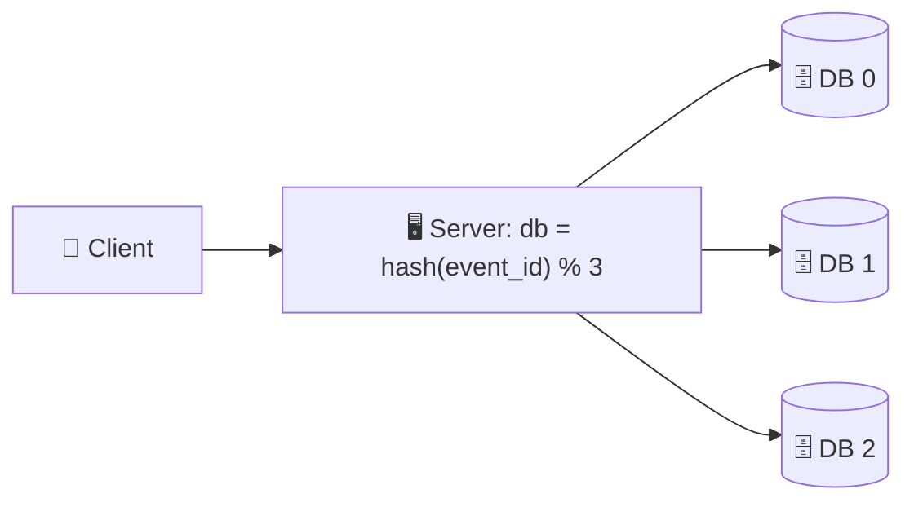

{: .intuition }
> **One-line pitch:** `hash(key) % N` reshuffles almost every key when N changes. Consistent hashing puts keys **and** nodes on a ring, and each key belongs to the **next node clockwise**. When a node joins or leaves, only the keys on its arc move, which is about **1/N of the data instead of nearly all of it**. Virtual nodes make the spread even. Replication makes failures cheap. In most interviews you **name it in one sentence**. You only go deep when the question is to build the distributed cache, database or broker yourself.

<details markdown="block">
<summary>Contents</summary>

- TOC
{:toc}
</details>

---

## 1. The Problem: `hash % N`

Ticketmaster starts with one database. It gets popular, one box can't keep up, and you [shard](sharding.html) events across three. The question is **which event lives on which database.**

The obvious answer is modulo hashing: hash the ID into a number, take it mod the number of databases.



```
db = hash(event_id) % number_of_databases

event 1234 → hash % 3 = 1 → DB 1
event 1234 → hash % 4 = 0 → DB 0   ← add a 4th DB and the same event now "lives" elsewhere
```

It distributes evenly and costs one arithmetic op. It works **until N changes.**

**Add a database** (`% 3` → `% 4`), or **lose one** (`% 3` → `% 2`), and the formula changes for *every* key, not just the ones that should move:

<div class="viz">
<p class="viz-legend"><span class="hl">■ key changes database, so its data must move</span> · <span class="done">■ key stays put</span> · small number under each cell = the key's hash</p>
{% include array.html v="0,1,2,0,1,2,0,1,2,0,1,2" label="hash % 3" note="12 keys on 3 databases" %}
{% include array.html v="0,1,2,3,0,1,2,3,0,1,2,3" done="0,1,2" hl="3,4,5,6,7,8,9,10,11" label="add → % 4" note="9 of 12 move. Only 3 needed to fill the new DB ❌" %}
{% include array.html v="0,1,0,1,0,1,0,1,0,1,0,1" done="0,1,6,7" hl="2,3,4,5,8,9,10,11" label="lose one → % 2" note="8 of 12 move. Only the 4 on the dead DB had to ❌" %}
</div>

| Change | Keys that move with `% N` | Keys that *have* to move |
|---|---|---|
| Add a node (N → N+1) | **~N/(N+1)**, 75% for 3 → 4 | 1/(N+1), just enough to fill the new node |
| Remove a node (N → N−1) | **~(N−1)/N**, 67% for 3 → 2 | 1/N, just the dead node's keys |

Every database is now shipping data to every other database at the same time. Load spikes everywhere, and reads are slow or miss entirely until the migration finishes.

{: .revisit }
> **Same chart as [Sharding §4.2](sharding.html#42-hash-based-the-default-)** (`% 4` → `% 5`, 80% move). In a **cache** it's even worse. Every moved key is a miss, so resizing the cache cluster is a mass invalidation, and the database eats a [stampede](caching.html#61-cache-stampede-thundering-herd) on every scale event.

---

## 2. The Hash Ring

Change one thing: **stop dividing by N.** Hash nodes and keys into the *same* fixed space, and bend that space into a circle.

1. Pick a fixed hash space. Real systems use 0 to 2³²−1 (Cassandra uses the 64-bit Murmur3 range). Here it's 0–100 to keep the numbers readable.
2. Put each node on the ring by **hashing the node's name**. Here 4 databases land at 0, 25, 50 and 75.
3. To place a key, hash it onto the ring and **walk clockwise to the first node.** That node owns it.

<div class="viz">

</div>

So each node owns the arc **from the previous node (exclusive) up to itself (inclusive)**. DB2 owns 1–25, DB3 owns 26–50, DB1 owns 76–100 plus 0.

{: .insight }
> **N is no longer in the formula.** A key's home depends only on its own hash and on which nodes sit near it on the ring. Adding or removing a node changes ownership of exactly **one arc**, the one next to that node. Everything else is untouched.

---

## 3. Adding and Removing Nodes

### 3.1 Add DB5

DB5 hashes to position 90. The keys between 75 and 90 used to walk clockwise to DB1 at 0. Now they stop at DB5 first.

<div class="viz">
{% include ring.html nodes="0:DB1,25:DB2,50:DB3,75:DB4,90:DB5:new" arc="75-90" note="Only keys on 75–90 move, all from DB1 to DB5. That's 15% of the ring. Every other key stays exactly where it was." %}
</div>

That's 60% of DB1's keys (15 of its 25 units), or **~15% of all keys.** With modulo it would have been ~80%.

### 3.2 Remove DB2

DB2 dies. Its keys (0–25) keep walking clockwise and land on DB3.

<div class="viz">

</div>

That's **exactly the 1/N that had to move.** This is the minimum possible, because those keys lived on a dead machine anyway.

### 3.3 Side-by-side

| | `hash % N` | **Hash ring** ✅ |
|---|---|---|
| Add a node | ~N/(N+1) of keys move, between **all** pairs of nodes | ~1/(N+1) on average, **only into the new node** |
| Remove a node | ~(N−1)/N move | **Only the dead node's keys**, into its clockwise neighbour |
| Lookup cost | O(1) arithmetic | O(log V) binary search over the sorted ring positions |
| Balance | Even by construction | Depends on where nodes land, so you need §4 |

{: .pitfall }
> **"~1/(N+1)" is an average, not a guarantee.** DB5 took 15%, not 20%, because nodes land wherever their hash puts them. With just one position per node, the arcs can be badly unequal. That's the next problem.

---

## 4. Virtual Nodes

### 4.1 Two problems with one point per node

1. **Failures dump everything on one neighbour.** After DB2 died, DB3 owned 0–50, double the load of DB1 or DB4. If DB3 tips over under that load, its whole arc slides onto DB4, and the failure cascades around the ring.
2. **Random placement means uneven arcs.** Four random points on a circle almost never split it into four equal quarters. One node can easily own 40% of the ring while another owns 10%. Adding a node also only relieves *one* neighbour.

### 4.2 The fix: many points per node

Put each physical node on the ring **many times** by hashing variations of its name: `DB1#0`, `DB1#1`, `DB1#2`, … Each of those positions is a **virtual node (vnode)**. Because they're hashed, the vnodes of different machines end up interleaved all around the ring.

<div class="viz">

</div>

Now kill DB2 again:

<div class="viz">

</div>

Each failure, and each addition, now touches **many small arcs owned by many different nodes**:

- **Removing a node** spreads its keys across all survivors.
- **Adding a node** takes a small slice from *every* existing node, so the whole cluster gets relief, not just one neighbour.
- **Balance improves with count.** With ~100+ vnodes per node, each node's total share of the ring converges on 1/N (the law of large numbers).
- **Weighting for free.** A machine with twice the RAM gets twice the vnodes and therefore twice the keys.

{: .aside }
> **How many vnodes?** More vnodes give smoother balance, but each one adds a ring entry, and every membership change touches more neighbours. Memcached's classic ketama client used ~160 points per server. Cassandra *lowered* its default `num_tokens` from 256 to 16 in 4.0, using a smarter allocation algorithm, because 256 made repair and streaming expensive. "On the order of 100 per node" is a fine interview answer.

---

## 5. What It Looks Like in Code

The whole algorithm is a **sorted array plus binary search.**

```python
import bisect, hashlib

def h(s):  # stable position on the ring. Never Python's hash(): it's salted per process
    return int.from_bytes(hashlib.md5(s.encode()).digest()[:4], "big")

class Ring:
    def __init__(self, nodes, vnodes=100):
        self.ring = sorted((h(f"{n}#{i}"), n) for n in nodes for i in range(vnodes))
        self.pos = [p for p, _ in self.ring]

    def node_for(self, key):
        i = bisect.bisect_left(self.pos, h(key))   # first vnode at or after the key
        return self.ring[i % len(self.ring)][1]    # ran off the end → wrap to the start
```

- **Lookup** is O(log(N·V)). With 50 nodes × 100 vnodes that's ~13 comparisons.
- **Add/remove** means inserting or deleting that node's V positions. Only keys in the arcs that end at those positions change owner.
- **The hash must be stable across machines.** Every router has to compute identical positions, or they disagree about where a key lives.

### 5.1 Who holds the ring?

The ring is only useful if **everyone routing requests sees the same one.** Three common placements:

| Where | Example | Watch out for |
|---|---|---|
| **Client library** | Memcached ketama clients, token-aware Cassandra drivers | Every client must learn about membership changes |
| **Any node coordinates** | Cassandra: nodes **gossip** membership, and whichever node receives a request forwards it to the owner | Brief disagreement while gossip converges |
| **Config service** | Ring stored in ZooKeeper/etcd, and routers watch it | One more dependency, but a single source of truth |

{: .pitfall }
> **A stale ring is a silent bug.** If two routers disagree about membership, they send the same key to different nodes. A cache serves stale data, and a store can split writes for the same key. In a "design a distributed cache" interview, say how membership is agreed before the interviewer asks.

---

## 6. Hot Spots: Keys vs Traffic

Vnodes spread **keys** evenly. They do nothing about one **key** being popular. If the Taylor Swift event gets 100x the reads of any other event, every one of those reads hashes to the same position and lands on the same node.

| Fix | How | Cost |
|---|---|---|
| **Read replicas** ✅ | Keep copies of the hot key on several nodes and load-balance reads across them. The most common fix | Writes fan out, and replicas may lag |
| **Key salting** | Store as `event:taylor-swift#0` … `#9` so the copies hash to different nodes. **Read-heavy:** write all copies, read a random one. **Write-heavy** (counters): write a random one, sum all on read | Every caller has to know about the suffix scheme |
| **Adaptive rebalancing** | Watch per-range traffic and split or move hot ranges. DynamoDB does this automatically ("split for heat") | Operationally complex if you build it yourself |
| **Bounded loads** | Cap each node at (1+ε)× the average load and send overflow to the next node clockwise (HAProxy's `hash-balance-factor`) | Some keys get served off their home node, so the cache hit rate drops a little |

{: .insight }
> **The one-line distinction interviewers listen for:** virtual nodes fix **structural** imbalance (uneven key ranges). Replication and salting fix **workload** imbalance (uneven traffic per key). Claiming vnodes solve the celebrity problem is a red flag.

{: .revisit }
> **Third time this shape has come up**, after [Sharding §5.1](sharding.html#51-hot-spots-and-load-imbalance) (celebrity shard) and [Caching §6.3](caching.html#63-hot-keys) (`user:taylorswift:r1…r10`). Even key distribution never implies even load. The fix is always the same family: give the hot key more than one home.

---

## 7. Data Movement in Practice

Consistent hashing says **where data should live**. It doesn't teleport terabytes when a node dies. Real systems pair it with **replication**, so most failures move no data at all.

<div class="viz">

</div>

- **Replica placement walks the ring.** Cassandra stores each key on its owner plus the next RF−1 nodes clockwise. With vnodes, it skips vnodes that belong to a machine already chosen, and topology-aware strategies also spread replicas across racks or AZs.
- **Failure means a promotion, not a migration.** DynamoDB keeps each partition on 3 replicas across availability zones. If the leader dies, a replica is elected leader through consensus (Multi-Paxos in DynamoDB's case), and nothing moves.
- **Data moves only on planned changes.** That means adding capacity (the new node streams its arcs from neighbours) or permanently replacing a node (re-replicating to restore RF). Even then, consistent hashing bounds it to a fraction of the keys.

{: .say }
> *"When a node fails, reads and writes fail over to the replicas that already hold its ranges. Nothing has to stream right away. We only move data when we replace the node or add capacity, and consistent hashing keeps that to about 1/N of the keys, pulled from many neighbours in parallel because of vnodes."*

---

## 8. In the Real World

Consistent hashing applies to any cluster where you route *by key*: databases, caches, message brokers, even stateful app servers.

| System | How it uses it |
|---|---|
| **Cassandra** | Murmur3 token ring with vnodes (`num_tokens`). Replicas go on the next RF nodes clockwise |
| **DynamoDB** | Descends from the Dynamo paper's ring. Today it hashes the partition key into partitions that it splits and moves itself |
| **Memcached clients** (ketama) | Client-side ring, so adding a cache server invalidates ~1/N of keys instead of all of them |
| **Load balancers / CDNs** | Envoy (ring hash, Maglev), HAProxy and CDNs route the same key to the same backend or edge, so its cache stays warm |
| **Redis Cluster** ⚠️ | **Not a ring.** 16,384 fixed hash slots, `CRC16(key) mod 16384`, with slot ranges assigned to nodes |

### 8.1 Variants worth naming

| Scheme | Lookup | Trade-off |
|---|---|---|
| **Ring + vnodes** | O(log V) binary search | The default. Tune V for balance vs metadata |
| **Fixed hash slots** (Redis Cluster) | O(1) slot table | Pick the slot count once, far more than nodes. Rebalancing reassigns whole slots, which needs a slot→node map everyone agrees on. Simpler to reason about |
| **Rendezvous / HRW** | O(N): score `hash(key, node)` for every node and take the highest | No vnodes needed and naturally even. Too slow with thousands of nodes |
| **Jump hash** | O(log N), zero memory | Nodes must be numbered 0…N−1, and you can only add or remove at the end. Good for numbered shards, bad for arbitrary node failures |

{: .aside }
> **The name gets used loosely.** As Kleppmann notes in *Designing Data-Intensive Applications*, plenty of systems that "use consistent hashing" are really fixed-slot partitioning. The principle that matters is **minimize data movement when membership changes**. "Pre-split into many logical shards" ([Sharding §7.2](sharding.html#72-the-four-beat-script): start with 64) is the same idea.

---

## 9. Consistent Hashing in the Interview

### 9.1 Name it or build it?

| Interview | What to do |
|---|---|
| Product design on DynamoDB / Cassandra / a managed store (Ticketmaster, feeds, chat…) | **One sentence.** *"Cassandra distributes by consistent hashing with vnodes, so adding nodes rebalances only a fraction of the data."* Then move on |
| **Design a distributed cache / KV store / database** | Go deep. This is the core of the question |
| **Design a message broker** (partition placement) | Go deep on partition → broker assignment |
| Stateful routing (WebSocket servers, per-user in-memory state) | Mention it for **sticky routing**: the same user hashes to the same server, and a server change remaps only ~1/N of users |

### 9.2 What "deep" covers

In an infrastructure interview, be ready to walk through all five:

1. **Why not modulo.** The N/(N+1) remap, and the cache-miss storm or mass migration it causes.
2. **The ring.** Hash nodes and keys into one space, walk clockwise, a binary search over sorted positions.
3. **Vnodes.** Even spread, failures spread across survivors, weighting for bigger machines.
4. **Hot spots.** Vnodes balance keys, not traffic. Replicas or salting fix the hot key.
5. **Replication + membership.** Replicas on the next distinct nodes clockwise, and how every router agrees on the ring.

{: .say }
> **~40-second narration, distributed cache:**
>
> *"I'll place cache servers on a hash ring with about 100 virtual nodes each, so every server owns many small arcs. The client library hashes the key and binary-searches the ring for the next vnode clockwise. Adding a server moves only about 1/N of keys, taken from every existing server, so we lose roughly 1/N of the cache instead of all of it like `% N` would. Membership lives in ZooKeeper, so all clients see the same ring. Hot keys are a separate problem: vnodes balance keys, not traffic. For something like the Taylor Swift event page, I'd replicate that key under a few suffixes and read a random copy."*

---

## 10. Level Expectations

| Level | What you must demonstrate |
|---|---|
| **Mid** | Explains why `% N` breaks when N changes. Describes the ring and the clockwise rule. Knows vnodes exist to even out the load |
| **Senior (E5)** | Puts numbers on it (N/(N+1) vs ~1/N). Explains vnodes as balance, failure spreading and weighting. **Separates key imbalance from traffic imbalance** and has a hot-key fix. Knows replicas make failure a promotion, not a migration. **Knows when to just name it** instead of deriving it |
| **Staff+** | Raises ring membership and agreement (gossip vs ZooKeeper) and the stale-ring failure mode. Knows replica placement skips vnodes of the same machine and spans racks/AZs. Compares the alternatives (hash slots, rendezvous, jump hash) and bounded loads. Reasons about vnode count vs streaming/repair cost |

---

## 11. Personal Drill List

*Targets recurring gaps from previous mock sessions.*

**1. Lead with the number.** Don't say "modulo is bad". Say *"`% N` remaps ~N/(N+1) of keys when you add a node, which is 75% going from 3 to 4. A ring moves ~1/(N+1)."*

**2. Reject with a cost.**

❌ *"I'll use consistent hashing."*

✅ *"Consistent hashing, not `% N`, because this cluster will grow. With modulo every resize would invalidate most of the cache and stampede the database."*

**3. Keys ≠ traffic.** Every time you say "vnodes", follow up with what they *don't* fix: the celebrity key. Have replicas or salting ready.

**4. Who holds the ring?** For any distributed cache or store design, say how membership is agreed (client library + ZooKeeper, or gossip). It costs one sentence and signals Staff-level thinking.

**5. Failure ≠ data movement.** Don't describe a node failure as "its data moves to the neighbour". The data is already on replicas. Movement only happens when you add capacity or replace a node.

**6. Name it, don't build it.** In product interviews it's one sentence attached to the database choice. Spending five minutes on the ring in a Ticketmaster interview is time not spent on the actual hard parts.

---

## 12. Rapid-Fire Self-Test

<details markdown="block">
<summary>1. What goes wrong with hash(key) % N when N changes?</summary>

Almost every key maps to a different node: ~N/(N+1) when adding one, ~(N−1)/N when removing one. That means massive data movement between all nodes, or a near-total cache miss storm.
</details>

<details markdown="block">
<summary>2. How does a key find its node on the ring?</summary>

Hash the key onto the same space as the nodes, then walk clockwise to the first node position (wrapping past the top). In code that's a binary search over the sorted node positions.
</details>

<details markdown="block">
<summary>3. Which arc does a node own?</summary>

From the previous node's position (exclusive) up to its own position (inclusive).
</details>

<details markdown="block">
<summary>4. Nodes at 0, 25, 50, 75. You add a node at 90. Which keys move, and from where?</summary>

Only keys in 76–90. They used to go to the node at 0, and now they stop at 90. Nothing else changes.
</details>

<details markdown="block">
<summary>5. The node at 25 dies. Which keys move?</summary>

Only its own keys (1–25), all to the next node clockwise (50). That's exactly the 1/N that had to move.
</details>

<details markdown="block">
<summary>6. Two problems with one ring position per node?</summary>

A failed node's whole load lands on a single neighbour, which can cascade. And random placement gives unequal arcs, so some nodes own far more keys than others.
</details>

<details markdown="block">
<summary>7. What are virtual nodes and what do they buy you?</summary>

Each physical node is placed on the ring many times (hash of `node#0`, `node#1`, …). You get an even spread, failures and additions that spread across many nodes, and weighting (bigger machines get more vnodes).
</details>

<details markdown="block">
<summary>8. Why not use a huge number of vnodes per node?</summary>

Each vnode is ring metadata, and every membership change touches more neighbours, so streaming and repair get more expensive. Cassandra cut its default from 256 to 16 for this reason.
</details>

<details markdown="block">
<summary>9. Do vnodes fix the Taylor Swift hot key? What does?</summary>

No. Vnodes balance *keys*, and one key still hashes to one place. Fix it with read replicas of the hot key, key salting (`key#0..9`), or adaptive splitting.
</details>

<details markdown="block">
<summary>10. Key salting: read-heavy vs write-heavy?</summary>

Read-heavy: write every copy, read a random one. Write-heavy (counters): write to a random copy, and sum all copies on read.
</details>

<details markdown="block">
<summary>11. A node dies in Cassandra/DynamoDB. Does its data move to the neighbour?</summary>

Not right away. Replicas on the next nodes clockwise (or in other AZs) already hold it, and a replica takes over. Data streams only when the node is permanently replaced or capacity is added.
</details>

<details markdown="block">
<summary>12. Why must the ring's hash function be stable, and why does membership matter?</summary>

Every router must compute the same positions and see the same nodes. Otherwise they send the same key to different nodes, giving stale cache reads or split writes. Agree on membership via gossip or a config service like ZooKeeper.
</details>

<details markdown="block">
<summary>13. How does Redis Cluster differ from a hash ring?</summary>

It uses 16,384 fixed hash slots (`CRC16(key) mod 16384`) with slot ranges assigned to nodes. Rebalancing reassigns whole slots. It's simpler to reason about but needs a slot map everyone agrees on.
</details>

<details markdown="block">
<summary>14. When do you go deep on consistent hashing in an interview?</summary>

Infrastructure questions: design a distributed cache, KV store/database or message broker. In product designs on DynamoDB/Cassandra, just name it in one sentence.
</details>

---

*Related patterns to cross-review: Scaling Reads (hot keys, replicas) · Scaling Writes (adding capacity without a full reshuffle). Related notes: [**Sharding**](sharding.html) (hash strategy, resharding, celebrity shard) · [**Caching**](caching.html) (hot keys, stampede on resize) · [**Data Modeling**](data-modeling.html) (shard key vs hashing scheme) · **Numbers to Know***
