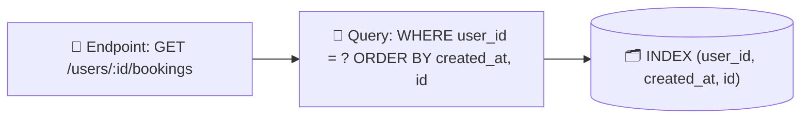
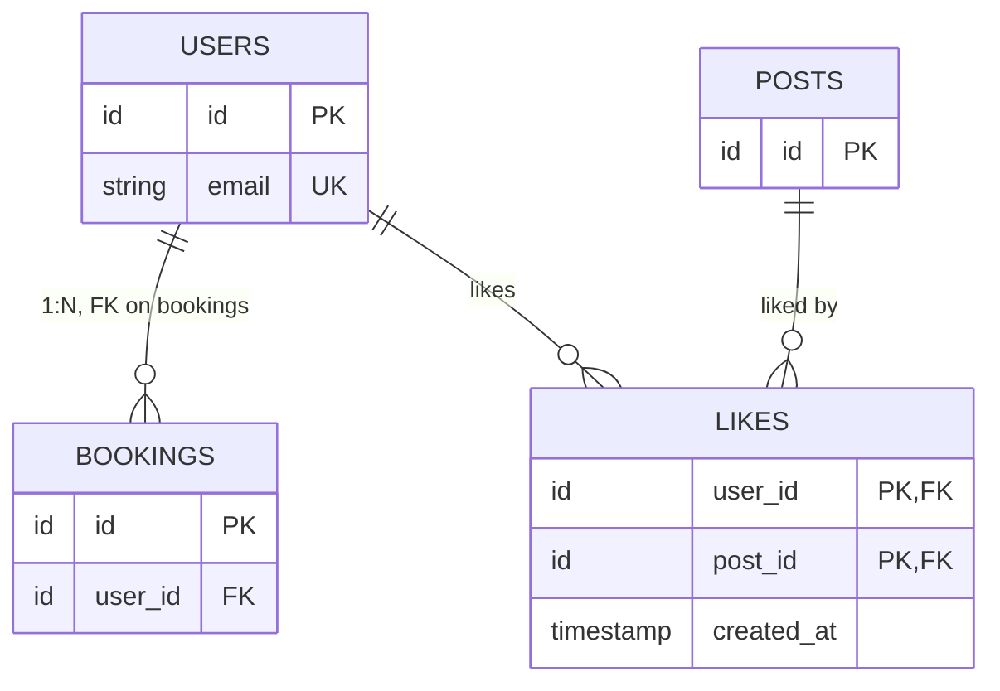
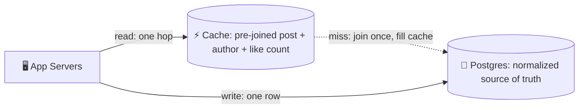
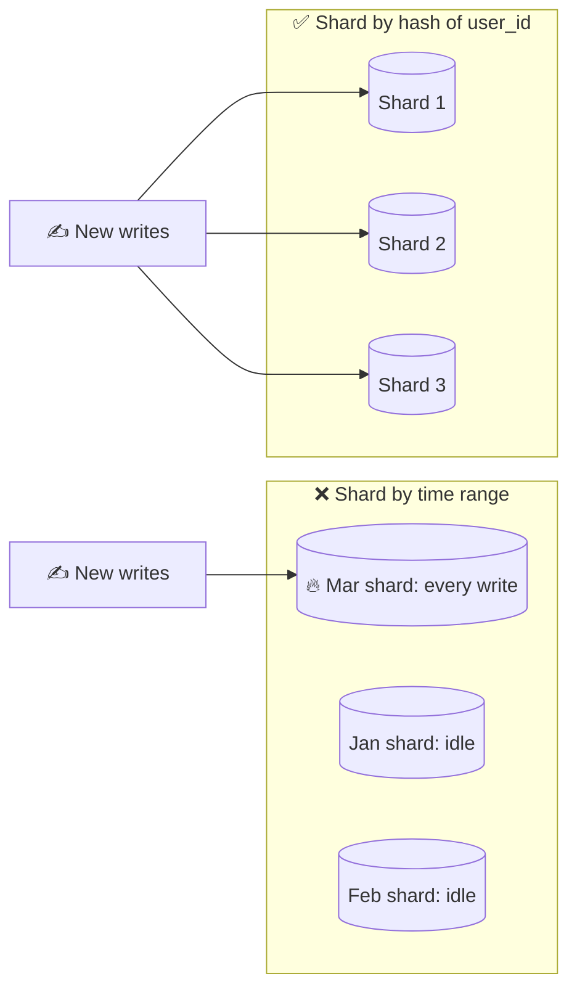
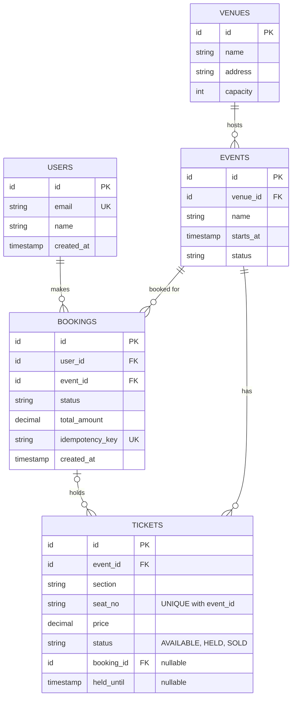

{: .intuition }
> **One-line pitch:** Data modeling is the bridge between your API and your architecture. You are not being graded on normal forms — you are being graded on whether your schema can actually serve the endpoints you just wrote, cheaply. Pick a relational DB by default, list columns, mark keys, name the indexes that back your reads, and say out loud which access pattern each choice serves.

<details markdown="block">
<summary>Contents</summary>

- TOC
{:toc}
</details>

---

## 1. Where This Fits

Data modeling shows up **twice** in the delivery framework, and they are different depths:

1. **Core entities (~2 min, during requirements)** — just the nouns. "Users, events, tickets, bookings." No columns yet. This is the vocabulary the rest of the interview will use.
2. **Schema sketch (~2–3 min, inside high-level design)** — when you draw the database box, annotate it. Columns, PKs/FKs, indexes, and a note on partitioning.

{: .pitfall }
> **This is not a data-modeling interview.** Nobody wants 3NF proofs, an ER diagram, or every audit column. "Good enough and clearly reasoned" beats "complete." Budget ~5 minutes total across both touchpoints.

**What the interviewer is actually checking:** can you go from *endpoint* → *query* → *storage* without a gap? A schema that can't serve your own `GET /events/{id}/tickets` in one indexed lookup is the failure mode. Everything else is decoration.



{: .revisit }
> **Cross-topic link — this is the other half of [API Design](api-design.html).** Every endpoint you wrote implies a query. The data model is where you prove that query is cheap. If you designed cursor pagination on `GET /events`, the schema must show a `(created_at, id)` index or the pagination story was fiction. Walk the endpoint list and check each one lands on an index.

---

## 2. Picking the Database Model

{: .insight }
> **Default is a relational database — usually PostgreSQL.** Say it in one sentence and move. Reaching for something exotic to look sophisticated is a *negative* signal unless the requirements forced it.

| Model | Shape | Pick when | What it does to your schema |
|---|---|---|---|
| **Relational** ✅ | **Tables, fixed schema, FKs, ACID** | **Default. Clear entities with relationships, transactional correctness** | **Normalize, add indexes per query** |
| Document | JSON docs, flexible schema | Schema genuinely varies per record, or deep nesting that would need many joins | Embed related data inside the doc; denormalize aggressively |
| Key-value | Exact-key lookup only | Cache, sessions, feature flags, hot-path reads | Flat. Duplicate data across keys, one key shape per access pattern |
| Wide-column | Partition key + clustering, sparse columns | Huge write volume, time-series, append-heavy telemetry | Model the query first; time becomes part of the key |
| Graph | Nodes + edges, traversal | Almost never in an interview | — |

**Two things worth saying about relational, because candidates undersell it:**

- **Joins are a feature, not a liability** — until they aren't. "Posts by everyone I follow, newest first" is a one-query join at small scale and a fan-out problem at large scale. Know which side of that line you're on before you promise the join.
- **"SQL doesn't scale" is lazy.** Read replicas, partitioning, connection pooling and a cache in front carry relational databases to enormous scale. The database you pick matters less than how you architect around it.

{: .pitfall }
> **Graph databases are the classic trap.** Social graphs and recommendations *sound* like graph problems, but the largest social networks run their core relationship data on relational stores with a caching layer. Choosing Neo4j buys you operational complexity and buys the interviewer nothing. If you want the graph point, make it as a trade-off you *considered and rejected*.

{: .aside }
> **Document databases have a hidden interview problem.** Their main justification is evolving schemas — but interview requirements are deliberately scoped and frozen. So the justification usually isn't available to you. Only pick one if the interviewer explicitly plants "the shape of this data varies a lot."

---

## 3. The Three Drivers

Everything downstream — keys, indexes, denormalization, sharding — is a tool serving one of three inputs you already gathered.

| Driver | Question it answers | What it changes |
|---|---|---|
| **Data volume** | Can this live on one machine? | Whether you shard, and whether entities must be split across stores |
| **Access patterns** ⭐ | **What queries must be fast?** | **Indexes, denormalization, shard key — most of your decisions** |
| **Consistency needs** | What must be exactly right, right now? | What stays in one ACID transaction vs. what can go eventual |

**Access patterns dominate, and they come free from your API.** You already listed the endpoints. Each one is a query. That list *is* your access-pattern list — don't invent a second one.

**Consistency splits your data, concretely.** Money, inventory and seat assignment need a transaction. Like counts, view counts and feed entries do not. That split is what lets you put the hot, tolerant data in a denormalized store and keep the strict data in one relational transaction.

{: .say }
> **Interview move — say the driver, not just the decision.**
>
> ❌ *"I'll denormalize the like count onto the post."*
>
> ✅ *"Feed reads are the hot path and a like count can lag a second or two, so I'll denormalize the count onto the post rather than aggregating at read time."*
>
> Decision, driver, tolerance — in one breath. Same rule as the API step.

---

## 4. Entities, Keys & Relationships

### 4.1 Turning entities into tables

The core entities you named earlier map roughly 1:1 to tables. Keep the names from the problem domain — `events`, `tickets`, `bookings`, not `EntityA`.

```sql
users    (id PK, email UNIQUE, name, created_at)
events   (id PK, venue_id FK→venues.id, name, starts_at, status)
venues   (id PK, name, address, capacity)
tickets  (id PK, event_id FK→events.id, section, seat_no, price, status)
bookings (id PK, user_id FK→users.id, event_id FK→events.id,
          status, total_amount, created_at)
```

### 4.2 Primary keys

**Use system-generated IDs, not business data.** `user_id`, not email. Emails change, phone numbers get reassigned, and business rules mutate — a surrogate key is stable forever and cheap to reference.

| Key choice | Good for | Watch out for |
|---|---|---|
| Auto-increment integer | Small, compact index, natural ordering | Leaks volume; needs coordination once sharded |
| UUIDv4 | Generate anywhere, no coordination | Random → poor B-tree locality, page splits on insert |
| **Time-sortable ID (ULID / Snowflake / UUIDv7)** ✅ | **Distributed generation *and* index locality; sorts by creation time for free** | **Slight clock/coordination story to explain** |

{: .insight }
> **A cheap senior signal:** "I'll use a time-sortable ID so writes append to the right of the index instead of scattering, and so the ID itself gives me a stable pagination cursor." One sentence, two problems pre-solved.

### 4.3 Relationships

- **1:N** — a user has many bookings. FK on the *many* side. `bookings.user_id`.
- **N:M** — users like many posts, posts are liked by many users. Needs a **join table**: `likes (user_id, post_id, created_at)` with a composite PK.
- **1:1** — rare, and usually a sign the two tables should be one. If you write one, justify it (different access frequency, different security boundary, or a column set that's expensive to load).



### 4.4 Foreign keys and constraints — and their cost

FKs give you **referential integrity**: no booking pointing at a user who doesn't exist, no orphaned rows after a delete. Constraints (`NOT NULL`, `UNIQUE`, `CHECK`) push correctness down into the database, where it can't be forgotten by one careless service.

{: .pitfall }
> **Both cost you writes.** Every FK insert validates the parent row; every constraint is work on the write path. At very large scale — and always once you shard, since a FK can't span shards — teams drop FKs and enforce integrity in the application. Mentioning that trade-off unprompted is the part that scores, not the FK itself.

{: .revisit }
> **A `UNIQUE` constraint is a concurrency primitive, not just a data-quality rule.** It is the same tool used for Bitly custom-alias reservation and for idempotency-key claiming: a second concurrent insert *fails* instead of racing. Fourth appearance of the contention pattern — read-modify-write on shared state needs the atomic boundary around the whole sequence. Name it as one pattern across problems.

---

## 5. Indexing for Access Patterns

An index is a lookup structure that turns a full scan into a seek. In the interview you don't explain B+trees unprompted — you **list which columns are indexed and which endpoint each index serves.**

```sql
-- GET /events?city=NYC&date_from=...
INDEX ON events (venue_id, starts_at)

-- GET /events/{id}/tickets?section=VIP
INDEX ON tickets (event_id, section)

-- GET /users/{id}/bookings  (cursor paginated)
INDEX ON bookings (user_id, created_at, id)
```

**Three rules that carry most of the value:**

1. **Composite index order matters — leftmost prefix.** An index on `(user_id, created_at)` serves "this user's bookings" and "this user's recent bookings," but *not* "everything created yesterday." Equality columns first, range/sort column last.
2. **Indexes are a write tax.** Every index is another structure to update on insert/update, plus storage. Write-heavy tables should carry the fewest indexes you can justify. Say this when someone asks "why not index everything?"
3. **The sort key of a paginated endpoint must be indexed and unique.** `created_at` alone isn't unique — two rows in the same millisecond break a cursor. `(created_at, id)` gives a total order.

Leftmost prefix, on an index sorted by `(user_id, created_at)`:

<div class="viz">
<p class="viz-legend"><span class="hl">■ rows the query reads</span> · <span class="done">■ one contiguous range = index seek</span></p>




</div>

{: .say }
> **Narrate indexes by endpoint, never as a list.**
>
> ❌ *"I'll index user_id and created_at."*
>
> ✅ *"`GET /users/{id}/bookings` is cursor-paginated, so I need a composite index on `(user_id, created_at, id)` — that makes the cursor an index seek at any depth instead of a scan."*

---

## 6. Normalization vs Denormalization

**Normalized** = each fact stored once. **Denormalized** = a fact copied where it's read, to avoid a join.

| | Normalized | Denormalized |
|---|---|---|
| Reads | Join required | Single-row fetch |
| Writes | One row changes | Every copy must change |
| Failure mode | Slow read at scale | **Silent inconsistency** — miss one copy, data is wrong forever |
| Recover by | Adding a cache or index | A backfill job and an apology |

{: .insight }
> **Default: start normalized, denormalize only where you can name the query that demanded it.** A performance problem is easier to fix later than a consistency problem. Duplicating a username into every post means one profile edit rewrites every post that user ever made.

**Legitimate exceptions — these are worth naming so you don't sound dogmatic:**

- **Counters on the hot read path** — like/view/comment counts stored on the parent row instead of `COUNT(*)` at read time. Tolerates lag.
- **Analytics and reporting** — pre-aggregated, refreshed on a schedule, source data doesn't change.
- **Event logs, audit trails, order line-items** — you deliberately snapshot the value *as it was*. A shipped order keeps the price at purchase time; that isn't duplication, it's history.
- **Search indexes** — Elasticsearch documents are denormalized copies by construction.

{: .insight }
> **The move that gets you both:** keep the source of truth normalized and put a **cache holding the denormalized shape** in front — pre-joined, pre-aggregated, whatever makes the read one hop. You get read speed without permanently corrupting your write model, and the blast radius of a stale copy is a TTL instead of a backfill. See [**Caching**](caching.html).



---

## 7. Sharding and the Partition Key

When one machine can no longer hold the data (or absorb the writes), you split rows across nodes by a **shard key**. Full deep dive: [**Sharding**](sharding.html).

**Shard by your dominant access pattern.** If reads are overwhelmingly "everything for user X," shard by `user_id` — that keeps a user's rows co-located and turns the common query into a single-shard hit.

{: .pitfall }
> **Time-range sharding is a trap for write-heavy systems.** It looks perfect for "recent posts," but *all current writes land on the newest shard* while the rest idle — a hot shard by construction. Time partitioning is fine for archival and analytics, where writes are spread and recency is read-heavy. Say why you rejected it and you've turned a trap into a signal.



**Two consequences to raise unprompted:**

- **Cross-shard queries are expensive.** Shard by `user_id`, then ask for "posts from the 200 people I follow" — you scatter to many shards and merge. That's the moment you introduce a fan-out-on-write feed table or a search index, not the moment you pretend the join is free.
- **The shard key is effectively permanent.** Changing it means rewriting everything. Treat it as a one-way door and say so.

{: .revisit }
> **Links to [Consistent Hashing](consistent-hashing.html).** Once you've picked *what* to shard on, consistent hashing is *how* you map keys to nodes so adding a node moves ~1/N of the data instead of remapping everything. Two separate decisions — candidates routinely blur them. Shard key = which rows travel together. Hashing scheme = where they land.

---

## 8. The Six-Step Whiteboard Recipe

When you draw the database in HLD, run this in order and you'll never blank:

1. **Pick the database type** — one sentence, usually "Postgres."
2. **List the columns** each entity needs to satisfy the functional requirements. No speculative fields.
3. **Mark PKs and FKs** — this is where relationships become visible.
4. **Name the indexes**, each tied to a specific endpoint.
5. **Decide on denormalization** — only if you can name the read that demanded it.
6. **Decide on sharding** — is one machine enough? If not, shard key = dominant access pattern, and say what breaks (cross-shard queries).

{: .aside }
> Steps 5 and 6 are frequently "no, not needed at this scale — here's the number that tells me so." An explicit *no* backed by an estimate scores as well as a yes.

---

## 9. Worked Example — Ticketmaster

Continuing the same problem from the [API Design](api-design.html) notes, so the contract and the storage line up.

```sql
users    (id PK, email UNIQUE, name, created_at)

venues   (id PK, name, address, capacity)

events   (id PK, venue_id FK, name, starts_at, status, created_at)
         INDEX (venue_id, starts_at)      -- browse by venue/date
         INDEX (starts_at, id)            -- cursor pagination on the event list

tickets  (id PK, event_id FK, section, seat_no, price,
          status,           -- AVAILABLE | HELD | SOLD
          booking_id FK NULL,
          held_until NULL)
         INDEX (event_id, section, status) -- availability lookup
         UNIQUE (event_id, seat_no)        -- one seat exists once

bookings (id PK, user_id FK, event_id FK, status, total_amount,
          idempotency_key UNIQUE, created_at)
         INDEX (user_id, created_at, id)   -- "my bookings", paginated
```



**Why each non-obvious choice exists:**

- `tickets.status` + `held_until` rather than a separate holds table — the contention is *on the ticket row*, so the lock and the state belong there. A conditional update `WHERE status='AVAILABLE'` is the atomic primitive.
- `UNIQUE (event_id, seat_no)` — makes double-allocation structurally impossible rather than a thing the application remembers to check.
- `bookings.idempotency_key UNIQUE` — the storage-layer half of the idempotency-key mechanism from the API notes. The uniqueness constraint *is* the atomic claim.
- No denormalized ticket count on `events` — availability must be exactly right (you cannot oversell a seat), so it stays a live query against a strongly consistent store.

{: .say }
> **~45-second narration:**
>
> *"Postgres, since bookings need ACID — overselling a seat isn't recoverable. Events and venues are straightforward normalized tables. Tickets carry their own status and hold expiry rather than a separate holds table, because the contention is on the ticket row and I want a conditional update to be the atomic operation. Unique on (event_id, seat_no) makes double-allocation impossible structurally. Bookings carry a unique idempotency key, which is what makes the client retry on that POST safe. Indexes: (event_id, section, status) for availability, and (user_id, created_at, id) for the paginated 'my bookings' endpoint — composite because the cursor needs a unique total order. I'm not denormalizing availability counts, because that's the one number that has to be exactly right. At this scale a single primary with read replicas is fine; if ticket volume forced it I'd shard by event_id, since almost every query is scoped to an event."*
>
> Every clause carries its reason. That's the whole bar.

---

## 10. Level Expectations

| Level | What you must demonstrate |
|---|---|
| **Mid** | Entities become tables with sensible columns. PKs and FKs marked. Picks a relational DB and doesn't agonize. Knows what an index is for |
| **Senior (E5)** | **Unprompted**: every index tied to a named endpoint; composite index ordering correct; explicit normalized-by-default stance with a named exception; says what stays transactional vs. what can be eventually consistent, and why. Rejects options out loud with the cost, not the vibe |
| **Staff+** | Treats the shard key as a one-way door and says so. Names the write cost of indexes and FKs. Recognizes uniqueness constraints as a concurrency primitive. Anticipates the cross-shard query the design will eventually hit and pre-empts it. Chooses ID scheme deliberately (locality, distributed generation, cursor stability) |

---

## 11. Personal Drill List

*Targets recurring gaps from previous mock sessions.*

**1. Justify in the same breath.** Same target as the API notes, applied to storage. Every schema decision needs its driver attached: not "index on `(user_id, created_at)`" but "index on `(user_id, created_at)` *so the paginated bookings endpoint is a seek, not a scan*."

**2. Walk the endpoint list.** This is the schema version of the response-shape gap. After you draw the schema, take 20 seconds and go endpoint by endpoint: *what query does this become, and what index serves it?* Any endpoint without an answer is a hole the interviewer will find.

**3. Say the consistency split out loud.** For every design, name one thing that must be strongly consistent and one that can lag. It's a two-sentence habit that immediately reads senior, and it justifies half your later decisions for free.

**4. Reject with a cost.** "Not a graph DB" is worth nothing. "Not a graph DB — the traversals here are one hop deep, so I'd take on operational complexity for no query I can't already serve" is worth a lot. Same for document stores and time-range sharding.

**5. Name the contention primitive.** Unique constraint · conditional update · optimistic version column. Fourth topic where this pattern appears (rate limiter, Bitly alias, idempotency keys, now schema constraints). Say it's the same shape before you're asked.

**6. Watch the clock — again.** Like API design, this section rewards being *done*. The failure mode is lovingly detailing seventeen columns. List what the requirements need, mark the keys, name the indexes, move to the interesting part of the design.

---

## 12. Rapid-Fire Self-Test

<details markdown="block">
<summary>1. Default database choice for a system design interview, and when to deviate?</summary>

Relational (Postgres). Deviate only when a requirement forces it: genuinely variable schema (document), pure key lookups on a hot path (KV/cache), or massive append-only write volume and time-series access (wide-column).
</details>

<details markdown="block">
<summary>2. Which of the three drivers shapes the most decisions, and where does it come from?</summary>

Access patterns. They come free from the API you already designed — each endpoint is a query.
</details>

<details markdown="block">
<summary>3. Why use a system-generated ID instead of email as the primary key?</summary>

Business data changes; surrogate keys don't. An email change would cascade through every referencing row. Surrogate keys are also smaller and index better.
</details>

<details markdown="block">
<summary>4. Why is a time-sortable ID (ULID/Snowflake/UUIDv7) often better than UUIDv4?</summary>

Random UUIDs scatter inserts across the B-tree, causing page splits and poor cache locality. Time-sortable IDs append to the right of the index and double as a stable pagination cursor — while still being generatable without coordination.
</details>

<details markdown="block">
<summary>5. An index on (user_id, created_at) — which queries does it serve, and which does it not?</summary>

Serves "rows for this user" and "this user's rows in a time range or sorted by time." Does *not* serve "all rows created yesterday" — leftmost prefix rule. Equality columns first, range/sort last.
</details>

<details markdown="block">
<summary>6. Why not just index every column?</summary>

Each index is storage plus write amplification — every insert and update maintains every index. Write-heavy tables should carry only the indexes their read paths justify.
</details>

<details markdown="block">
<summary>7. Denormalizing a username onto every post — what exactly goes wrong?</summary>

A username change requires rewriting every post that user ever made. Miss any and the data is silently inconsistent forever. The read speedup is recoverable with a cache; the consistency damage is not.
</details>

<details markdown="block">
<summary>8. Name three cases where denormalization is genuinely right.</summary>

Hot-path counters that tolerate lag (like/view counts); pre-aggregated analytics over data that doesn't change; deliberate point-in-time snapshots (order line-item prices, audit logs). Search indexes are a fourth, by construction.
</details>

<details markdown="block">
<summary>9. How do you get denormalized read speed without a denormalized source of truth?</summary>

Keep the database normalized and put a cache in front holding the pre-joined or pre-aggregated shape. Staleness becomes a TTL instead of a permanent corruption.
</details>

<details markdown="block">
<summary>10. Why is time-range sharding usually an anti-pattern for write-heavy systems?</summary>

All current writes hit the newest shard while the others idle — a hot shard by construction. It's acceptable for archival/analytics where writes are spread and recency is read-heavy.
</details>

<details markdown="block">
<summary>11. You shard posts by user_id. What breaks, and what do you do about it?</summary>

Any query spanning users — a follower feed — becomes a scatter-gather across shards plus a merge. Fix by precomputing (fan-out-on-write feed table) or by serving it from a purpose-built index, not by pretending the cross-shard join is cheap.
</details>

<details markdown="block">
<summary>12. What's the difference between choosing a shard key and using consistent hashing?</summary>

The shard key decides *which rows travel together*. Consistent hashing decides *which node a key lands on*, so adding or removing a node remaps roughly 1/N of keys instead of everything. Independent decisions.
</details>

<details markdown="block">
<summary>13. Why is a UNIQUE constraint more than a data-quality rule?</summary>

It's an atomic concurrency primitive. Two concurrent inserts of the same value: one succeeds, one fails deterministically. That's how alias reservation and idempotency-key claiming avoid check-then-insert races.
</details>

<details markdown="block">
<summary>14. When would you drop foreign keys, and what replaces them?</summary>

At very large write volume, and always once you shard (FKs can't span shards). Integrity moves into the application layer — which means you own the orphan-cleanup story you just gave away.
</details>

<details markdown="block">
<summary>15. Six steps, in order, when you draw the database in HLD.</summary>

DB type → columns per entity → PKs and FKs → indexes tied to endpoints → denormalization (only with a named read) → sharding (only with a number that demands it).
</details>

---

*Related pages to cross-review: [API Design](api-design.html) (endpoints → queries · idempotency keys) · [Caching](caching.html) (denormalized shape in a cache) · [Sharding](sharding.html) (shard key, hot spots, cross-shard queries) · **Rate Limiter** (contention primitives) · **Bitly** (unique constraint as reservation) · **Dropbox** (metadata modeling for large blobs)*
