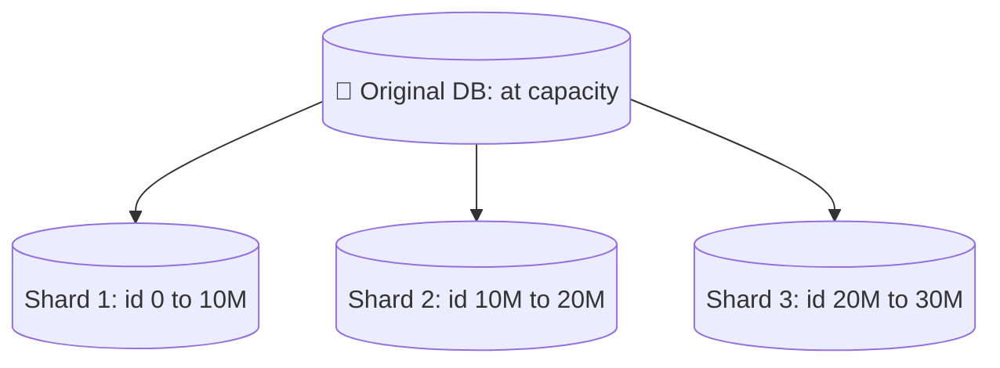
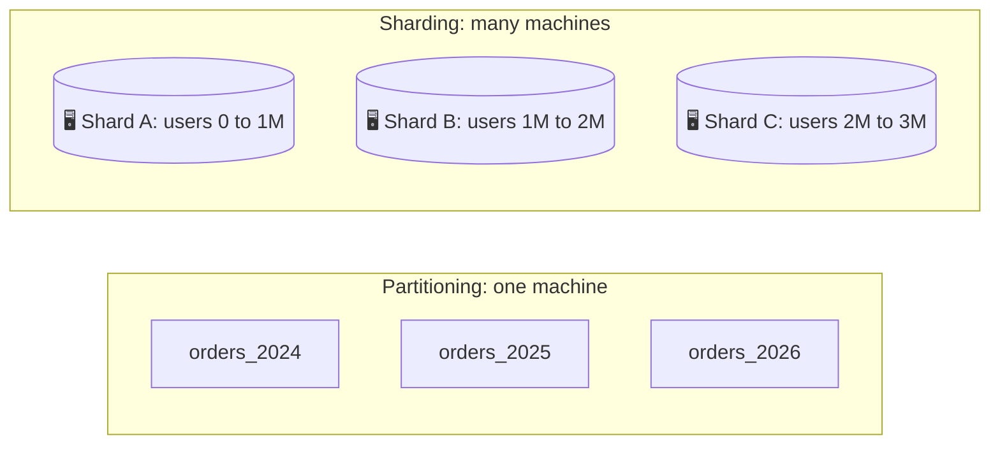
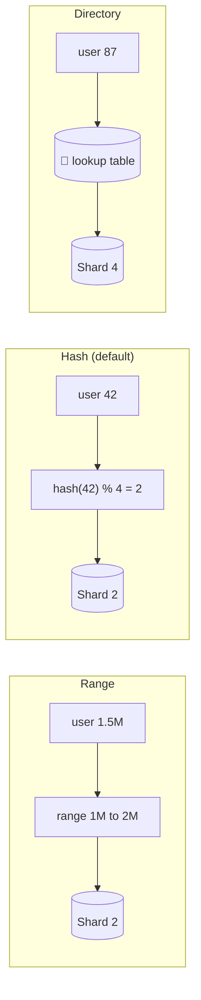
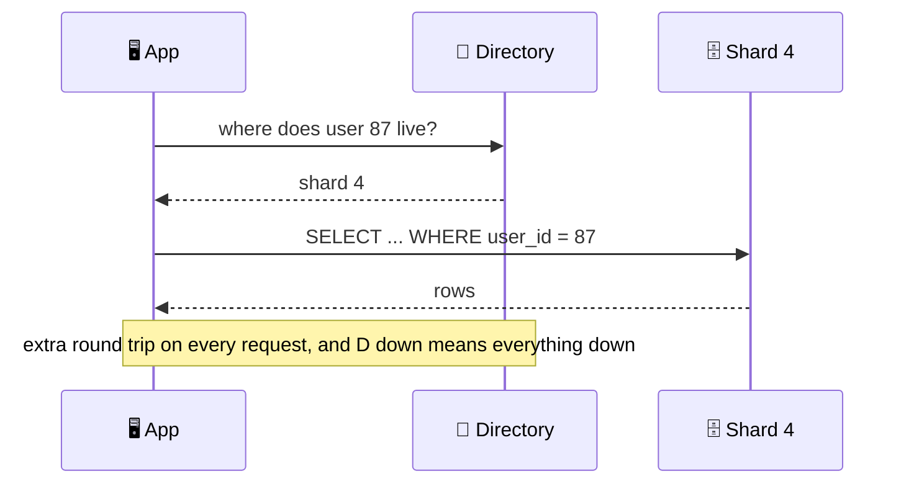
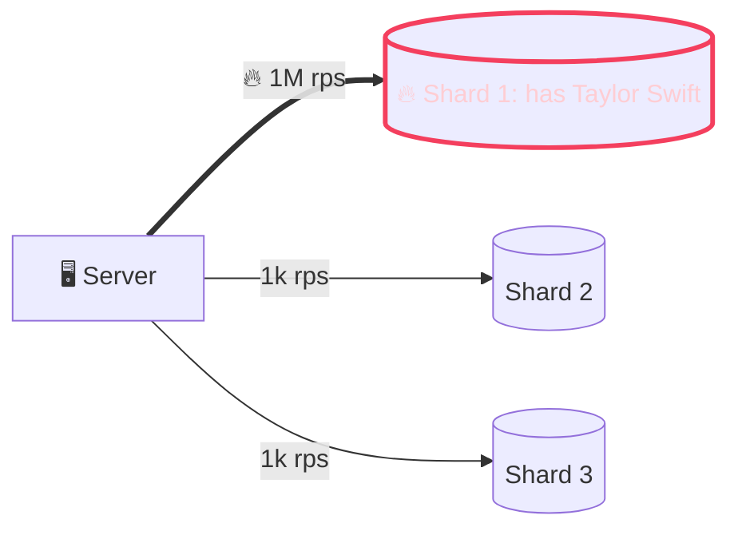
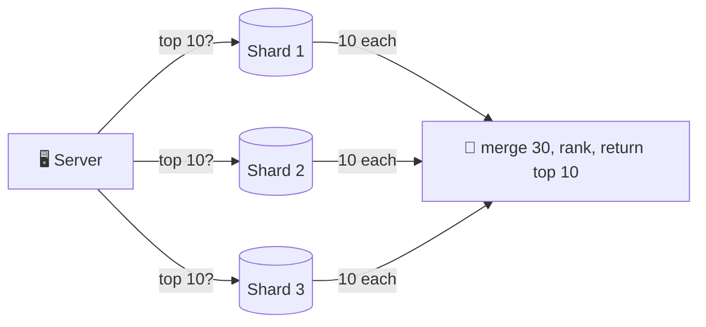
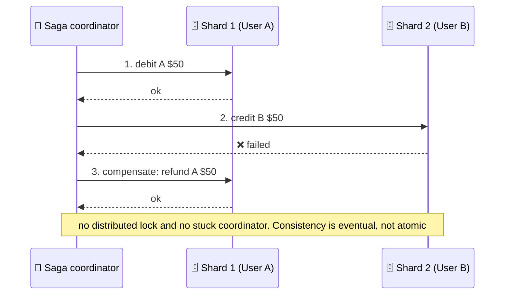
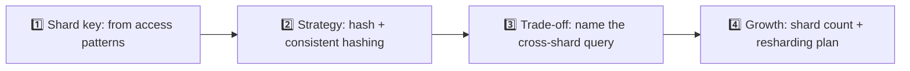

{: .intuition }
> **One-line pitch:** Sharding means splitting your rows across many independent databases once one machine can't hold the data or absorb the traffic. You only get credit for it once you've *proved* one database is not enough. Then the job is three sentences: what you shard by, how keys map to shards, and what it breaks (hot keys, cross-shard queries, cross-shard transactions). Default answer: **hash of `user_id`, consistent hashing, and a plan for the global query.**

<details markdown="block">
<summary>Contents</summary>

- TOC
{:toc}
</details>

---

## 1. Why Shard At All

The growth path is always the same. You scale **up** first: bigger instance, more CPU, more RAM, faster disk. That buys a lot of time. Then you hit the ceiling of one box. Queries slow down, the write path saturates, storage runs out. Even managed giants like Aurora stop around **~256 TiB**.

At that point there is only one move left: **split the data across machines.**



Each shard is a **standalone database** with its own CPU, memory, disk and connection pool. No single machine holds everything or serves everything, so storage *and* read/write throughput grow as you add shards.

{: .pitfall }
> **Sharding is not free scale. It is a trade.** You now own shard-key choice, query routing, hot spots and rebalancing. Every one of those is a follow-up question waiting to happen. Don't open that door until the numbers force you to.

---

## 2. Partitioning vs Sharding

People use the words loosely. The real distinction is **one machine vs many**.

| | Partitioning | Sharding |
|---|---|---|
| Where the data lives | **One** database instance | **Many** independent machines |
| What it fixes | Huge tables: slow scans, bloated indexes, maintenance that locks everything | Machine limits: storage, write throughput, read throughput |
| Adds hardware? | No | Yes |
| Cross-piece queries | Still one DB, the planner handles it | Network fan-out, *you* handle it |

**Two flavors of partitioning:**

- **Horizontal**: split *rows*. Same columns, fewer rows per partition (e.g. one partition per year of `orders`). A "last month's orders" query only scans one partition.
- **Vertical**: split *columns*. Same rows, fewer columns per partition. Hot narrow columns live in one place, wide or rarely-read blobs in another.

{: .insight }
> **Sharding = horizontal partitioning across machines.** That one sentence ends the terminology debate. In the interview, don't argue about the words. Just be explicit about whether the data is on one box or many.



---

## 3. Choosing the Shard Key

Sharding is two decisions that work together:

1. **What to shard by** (the *shard key*): which field groups rows together.
2. **How to distribute** (the *strategy*): the rule that maps those groups to machines.

In the interview this sounds like *"I'll shard by `user_id`."* The marks are in the **why**.

**A good shard key has three properties:**

| Property | Means | Fails when |
|---|---|---|
| **High cardinality** | Many distinct values, so there's room for many shards | A boolean gives you at most 2 shards |
| **Even distribution** | Values spread evenly across shards | `country` with 90% of users in the US gives you one giant shard |
| **Aligns with queries** ⭐ | **Your common queries hit exactly one shard** | **Every common query fans out to all shards** |

| Key | Verdict | Why |
|---|---|---|
| `user_id` (user-centric app) | 🟢 | Millions of values, spreads evenly, and most queries are already "this user's stuff" |
| `order_id` (orders table) | 🟢 | Huge cardinality, queries are per-order ("get order", "update status"), spreads over time |
| `is_premium` | 🔴 | Two values means two shards, and the free tier is a monster |
| `created_at` (growing table) | 🔴 | Every new write lands on the newest shard. That shard is hot by construction |

{: .revisit }
> **Same rule as [Data Modeling](data-modeling.html): shard by your dominant access pattern.** Your endpoint list is your access-pattern list. If nearly every endpoint is scoped to a user, `user_id` picks itself. The shard key is also effectively **permanent**. Changing it means rewriting every row, so treat it as a one-way door and say so.

---

## 4. Distribution Strategies

Once you have the key, you need the mapping from key to shard. There are three options.



### 4.1 Range-based

Assign contiguous key ranges to shards.

```
Shard 1 → user_id 1–1M
Shard 2 → user_id 1M–2M
Shard 3 → user_id 2M–3M
```

- ✅ Simple, and **range scans stay on one shard** ("users 500K–600K" is a single-shard query).
- ❌ Real traffic is rarely uniform across ranges. Shard by `created_at` and the newest range takes every write and most reads while old shards idle.
- 🎯 **Good fit: multi-tenant SaaS.** Each company owns a range of IDs. Company A only queries A's range and B only queries B's, so load naturally spreads by tenant.

### 4.2 Hash-based (the default) ✅

Hash the key, then use the hash to pick a shard.

```
shard = hash(user_id) % 4

User 42  → hash(42)  % 4 = Shard 2
User 99  → hash(99)  % 4 = Shard 3
User 123 → hash(123) % 4 = Shard 1
```

- ✅ **Even distribution.** The hash scrambles the input, so sequential IDs and new users spread evenly.
- ❌ You lose cheap range scans (adjacent keys land on different shards).
- ❌ **Naive modulo makes resharding a disaster.** Going from `% 4` to `% 5` changes almost every key's home:

<div class="viz">
<p class="viz-legend"><span class="hl">■ key changes shard, so its data must move</span> · <span class="done">■ key stays put</span> · small number under each cell = the key's hash</p>
{% include array.html v="0,1,2,3,0,1,2,3,0,1,2,3" label="hash % 4" note="12 keys spread over 4 shards" %}
{% include array.html v="0,1,2,3,4,0,1,2,3,4,0,1" done="0,1,2,3" hl="4,5,6,7,8,9,10,11" label="hash % 5" note="add one shard and 8 of 12 keys move ❌" %}
</div>

In general, going from N to N+1 shards with modulo moves about **N/(N+1)** of all data. From 4 to 5, that's ~80%.

{: .insight }
> **The fix is consistent hashing.** Keys and shards both sit on a hash ring, and a key belongs to the next shard clockwise. Adding a shard only steals keys from its neighbour, so roughly **1/(N+1)** of the data moves instead of nearly all of it. Hash sharding is great *as long as you have a resharding plan*. Say "consistent hashing" in the same breath as "hash on `user_id`".

{: .aside }
> This is the strategy your interviewer will **assume** unless you say otherwise. You don't need to defend picking it. You need to defend *deviating* from it.

### 4.3 Directory-based

A lookup table (or service) stores where every key lives.

```
user_to_shard
---------------
User 15   → Shard 1
User 87   → Shard 4
User 204  → Shard 2
```

- ✅ **Maximum flexibility.** Move one heavy user to a dedicated shard, rebalance by editing a row, encode any placement logic a formula can't.
- ❌ **Every request pays an extra hop** to ask where the data is.
- ❌ **The directory is a critical dependency.** If it's down, the whole system is down, even with every data shard healthy.



{: .pitfall }
> **Directory sharding is rarely the interview answer.** It adds latency to every request and a single point of failure, and both invite follow-ups that can derail you. Mention it only as the escape hatch for a specific problem (isolating a celebrity key, see §5.1), not as your base strategy.

### 4.4 Side-by-side

| | Range | **Hash** ✅ | Directory |
|---|---|---|---|
| Distribution | Uneven if access skews by range | **Even** | Whatever you decide |
| Range scans | **Cheap**, one shard | Fan out to all shards | Depends on mapping |
| Adding shards | Split a range | **Consistent hashing → ~1/N moves** | Edit the table |
| Extra hop / SPOF | No | No | **Yes / Yes** |
| Reach for it when | Multi-tenant, range-heavy reads | **Default** | You need per-key placement |

---

## 5. Challenges

Sharding fixes capacity and creates three new problems. You can't avoid them, but you can design around each one.

### 5.1 Hot spots and load imbalance

A **hot spot** is one shard doing far more work than the rest. It becomes the bottleneck and erases the point of sharding.

**The celebrity problem.** Shard by `user_id` and Taylor Swift's shard takes ~1000x the traffic of a normal one. Every profile view, like and DM to her lands on the same shard. **Hashing doesn't help.** The problem isn't the distribution, it's that one *key* is inherently hot.



**Time-based hot spots** are the other kind. Shard by creation date and the newest shard eats every write while the historical shards only serve occasional reads.

**Detect** it by comparing per-shard metrics: query latency, CPU, request volume. One shard consistently above the others means you have a hot spot.

**Fixes:**

| Fix | How | Cost |
|---|---|---|
| **Isolate hot keys** | Move the celebrity to a dedicated shard (this is where a small directory earns its keep) | A lookup for the special cases |
| **Compound shard key** | Shard by `hash(user_id + date)` so one user's data spreads across shards over time | A single user's reads now span shards |
| **Dynamic splitting** | Let the DB split and migrate hot or oversized chunks. MongoDB's balancer does it automatically; Vitess resharding is online but operator-driven | Tied to what your DB supports |

{: .revisit }
> **Same shape as hot keys in [Caching](caching.html).** One key carries outsized traffic, and spreading *keys* evenly doesn't spread *load*. The tools rhyme too: give the hot key its own capacity, or split it into several sub-keys.

### 5.2 Cross-shard operations

Any query that doesn't align with the shard key becomes a **scatter-gather**: send it to every shard, wait for the slowest one, merge the results yourself.

"Get user 12345's profile" hits one shard. "Top 10 most popular posts globally" hits **all** of them, because posts are scattered by author. With 64 shards that's 64 network calls, and you're as slow as the slowest shard.



**Minimize it:**

- **Cache the result.** Cache "top 10 posts" for 5 minutes. The first request pays the fan-out and the next thousand hit the cache. Great for anything that tolerates staleness: leaderboards, trending, aggregate stats.
- **Denormalize to co-locate.** Store the post data you read alongside the user on the user's shard. You duplicate data and complicate writes, but the read becomes single-shard.
- **Precompute it.** A background job builds the global view on a schedule so no request ever does the fan-out.
- **Accept it when it's rare.** An admin "total users" dashboard loaded a few times a day can afford the fan-out.

{: .say }
> **A scatter-gather on a hot path is a design smell, so say that out loud.**
>
> ❌ *"For trending, we'll query all shards and aggregate."*
>
> ✅ *"Trending spans every shard, so I won't compute it per request. A background job aggregates it every minute into a cache. Trending can lag a minute, and that keeps the hot path single-shard."*

### 5.3 Consistency across shards

On one database, "deduct inventory and create the order" is one ACID transaction. Once the account is on shard 1 and the order is on shard 2, **there is no single transaction to wrap them in.** Two databases that don't know about each other each have to commit.

**Two-phase commit (2PC)** is the textbook answer. A coordinator asks every shard to *prepare*, waits for all of them to say yes, then tells them all to *commit*. It's correct, but slow (extra round trips, locks held across the network) and fragile (if the coordinator dies mid-flight, participants can sit stuck holding locks). Most production systems avoid it.

**What to do instead, in order of preference:**

1. **Design so it never happens** ✅. Shard by `user_id` and keep *everything* about a user on their shard: balance, transaction history, profile. Every transaction is then single-shard, which is fast and reliable.
2. **Saga for the unavoidable cases.** Break the operation into local steps, each with a **compensating action**. If step N fails, run the compensations for steps N-1 back to 1.
3. **Accept eventual consistency** where it's fine. A follower count denormalized across shards can disagree for a few seconds and converge.



{: .insight }
> **If you keep needing distributed transactions, the shard key is wrong.** It means things that change together don't live together. Before reaching for 2PC or sagas, ask whether a different key (or different shard boundaries) would make the transaction single-shard.

{: .revisit }
> **The contention pattern, fifth appearance** (after rate limiter, Bitly alias, idempotency keys and schema constraints). A read-modify-write needs its atomic boundary around the whole sequence. With sharding, the new rule is that **the atomic boundary has to fit inside one shard.** Choosing the shard key *is* choosing where your transactions can live.

---

## 6. Sharding in Modern Databases

You almost never build sharding by hand. You pick a partition key and the database routes, splits and rebalances. The mechanics differ, and it's worth knowing roughly how:

| Database | How it distributes | Rebalancing |
|---|---|---|
| **Cassandra** | Partitioner (Murmur3) + virtual nodes, a form of **consistent hashing** onto token ranges | Automatic when nodes join |
| **DynamoDB** | Hashes the partition key to internal partitions (not a user-visible ring) | **Splits/merges** partitions as they grow |
| **MongoDB** | **Range-based chunks** on the shard key (over the hash space if the key is hashed) | Background **balancer** splits and migrates chunks |
| **Vitess** (MySQL) / **Citus** (Postgres) | Sharding layer in front of SQL: routing, cross-shard queries, resharding | Online resharding, **operator-driven** |
| **Spanner / Aurora** | Distributed SQL with built-in sharding | Managed |

{: .say }
> **One sentence is enough unless they dig:**
>
> *"DynamoDB with `user_id` as the partition key."* or *"Postgres sharded with Citus on `user_id`, with a plan for online resharding."*
>
> Don't explain the internals unless you're asked.

---

## 7. Sharding in the Interview

### 7.1 When to bring it up

{: .pitfall }
> **The #1 sharding mistake is sharding before proving you need to.** Do the math first. A well-tuned single Postgres with read replicas goes surprisingly far, and saying "no shard needed, here's the number" scores as well as a correct sharding design.

The formula: **identify the bottleneck, show why one database can't take it, then propose sharding.** The trigger is always one of three limits:

| Limit | Sounds like |
|---|---|
| **Storage** | *"500M users × 5 KB ≈ 2.5 TB. One Postgres handles that today. At 10x growth we'd need to shard."* |
| **Write throughput** | *"Peak is ~50K writes/sec. A single primary won't absorb that, so writes have to spread."* |
| **Read throughput** | *"Even with read replicas, 100M DAU making several queries each is more than one dataset's replicas can serve."* |

{: .aside }
> Notice that read throughput is the **last** reason to shard. Replicas and a cache usually solve reads first. Writes and storage are what genuinely force a split.

### 7.2 The four-beat script

Walk through it in this order and it flows naturally. Example: a social media app.



{: .say }
> **~40-second narration:**
>
> *"**Key:** almost every query here is user-scoped. Feed, followers, likes all hang off a user. So I'll shard by `user_id`. **Strategy:** hash-based with consistent hashing, so users spread evenly. **Trade-off:** global queries like trending now hit every shard, so I won't compute them per request. A background job precomputes trending into a cache. **Growth:** I'll start with 64 logical shards for headroom. Consistent hashing means adding capacity moves only a fraction of the data, not all of it."*
>
> Every beat carries its reason. That's the whole bar.

---

## 8. Level Expectations

| Level | What you must demonstrate |
|---|---|
| **Mid** | Knows what sharding is and that it's horizontal partitioning across machines. Picks a reasonable shard key (`user_id`) with hash distribution. Knows cross-shard queries are expensive |
| **Senior (E5)** | **Unprompted**: proves the need with numbers before sharding. Ties the shard key to the dominant access pattern. Names consistent hashing for resharding. Calls out the specific cross-shard query the design creates and pre-empts it with a cache or precompute. Keeps transactional data on one shard |
| **Staff+** | Treats the shard key as a one-way door. Anticipates the celebrity hot key and has a mitigation (isolation, compound key). Explains why 2PC is avoided and when a saga is justified. Knows how their chosen DB actually distributes and rebalances (Cassandra vnodes vs DynamoDB splits vs Vitess operator-driven). Says what they *won't* shard and why |

---

## 9. Personal Drill List

*Targets recurring gaps from previous mock sessions.*

**1. Do the math before you say "shard".** Write the number down: rows × bytes, peak writes/sec. If one box handles it, say "no shard needed yet, here's the number." This is the sharding version of "justify in the same breath."

**2. Key, strategy, trade-off, growth, in one flow.** Don't stop at "shard by `user_id`." The four beats in §7.2 are the minimum complete answer. Rehearse them until they come out as a single paragraph.

**3. Name the query that breaks.** Every shard key leaves one query behind that fans out. Find it yourself and say how you'll serve it (cache, precompute, denormalize) before the interviewer finds it for you.

**4. Reject with a cost.** "Not directory-based" is worth nothing. "Not directory-based, because it's an extra hop on every request and a single point of failure for no benefit at this scale" is worth a lot. The same goes for range on `created_at`: "every write lands on the newest shard."

**5. Celebrity check.** For any user-keyed design, ask: what happens to the shard holding the most-followed account? Have isolation or a compound key ready.

**6. Transactions stay on one shard.** If a write spans two shards, first ask if the key is wrong. Saga second. 2PC only to explain why you're not using it.

---

## 10. Rapid-Fire Self-Test

<details markdown="block">
<summary>1. What makes a good shard key?</summary>

High cardinality, even distribution, and alignment with the dominant query pattern, so common queries hit exactly one shard.
</details>

<details markdown="block">
<summary>2. Partitioning vs sharding: what's the actual difference?</summary>

Partitioning splits a table *within one database instance*. Sharding splits data *across multiple machines*. Sharding is horizontal partitioning across machines.
</details>

<details markdown="block">
<summary>3. Horizontal vs vertical partitioning?</summary>

Horizontal splits rows (same columns, fewer rows per partition). Vertical splits columns (same rows, fewer columns, e.g. hot narrow columns separated from wide rarely-read ones).
</details>

<details markdown="block">
<summary>4. Why is is_premium a bad shard key?</summary>

Two values means at most two shards, and the distribution is wildly skewed toward free users. That gives low cardinality and uneven distribution at the same time.
</details>

<details markdown="block">
<summary>5. Why is created_at a bad shard key for a growing, write-heavy table?</summary>

Every new write lands on the most recent shard, so it's hot by construction while older shards idle.
</details>

<details markdown="block">
<summary>6. Which strategy is the default, and why?</summary>

Hash-based. The hash spreads keys evenly regardless of their natural ordering, and interviewers assume it unless you say otherwise.
</details>

<details markdown="block">
<summary>7. What goes wrong going from hash % 4 to hash % 5, and what fixes it?</summary>

Almost every key maps to a new shard (~N/(N+1), so ~80%), forcing massive data movement. Consistent hashing fixes it: only ~1/(N+1) of keys move when a shard is added.
</details>

<details markdown="block">
<summary>8. When is range-based sharding a good fit?</summary>

When different clients naturally query different ranges, like multi-tenant SaaS where each tenant owns a contiguous ID range. It also gives cheap range scans.
</details>

<details markdown="block">
<summary>9. Two downsides of directory-based sharding?</summary>

An extra lookup on every request (latency), and the directory becomes a critical dependency. If it's down, everything is down even with healthy shards.
</details>

<details markdown="block">
<summary>10. Why doesn't hash sharding fix the celebrity problem?</summary>

The issue isn't how keys are spread. One *key* is inherently hot, and hashing still sends every request for that key to the same shard.
</details>

<details markdown="block">
<summary>11. Three ways to handle a hot spot?</summary>

Isolate the hot key on a dedicated shard; use a compound key like `hash(user_id + date)` to spread one key's data; rely on dynamic shard splitting (e.g. MongoDB's balancer).
</details>

<details markdown="block">
<summary>12. You need "top 10 posts globally" with posts sharded by user. What do you do?</summary>

Don't scatter-gather per request. Precompute it with a background job and/or cache the result for a few minutes. Trending tolerates staleness.
</details>

<details markdown="block">
<summary>13. Why do most production systems avoid 2PC?</summary>

It's slow (extra round trips, locks held across the network) and fragile. A coordinator or participant failure mid-transaction can leave shards stuck holding locks.
</details>

<details markdown="block">
<summary>14. How does a saga transfer money between users on different shards?</summary>

Debit A on shard 1, then credit B on shard 2. If the credit fails, run the compensating action (refund A). You get eventual consistency without a distributed lock.
</details>

<details markdown="block">
<summary>15. What's the three-step formula for introducing sharding in an interview?</summary>

Identify the bottleneck (storage, write or read throughput), explain with numbers why one database can't handle it, then propose sharding: key, strategy, trade-off, growth.
</details>

---

*Related patterns to cross-review: Dealing with Contention (keep the atomic boundary on one shard) · Multi-step Processes (sagas, 2PC) · Scaling Reads (replicas before shards) · Scaling Writes (when the primary saturates). Related notes: [**Data Modeling**](data-modeling.html) (shard key = dominant access pattern) · [**Caching**](caching.html) (hot keys, caching cross-shard results) · [**API Design**](api-design.html) · **Consistent Hashing** · **Numbers to Know***
